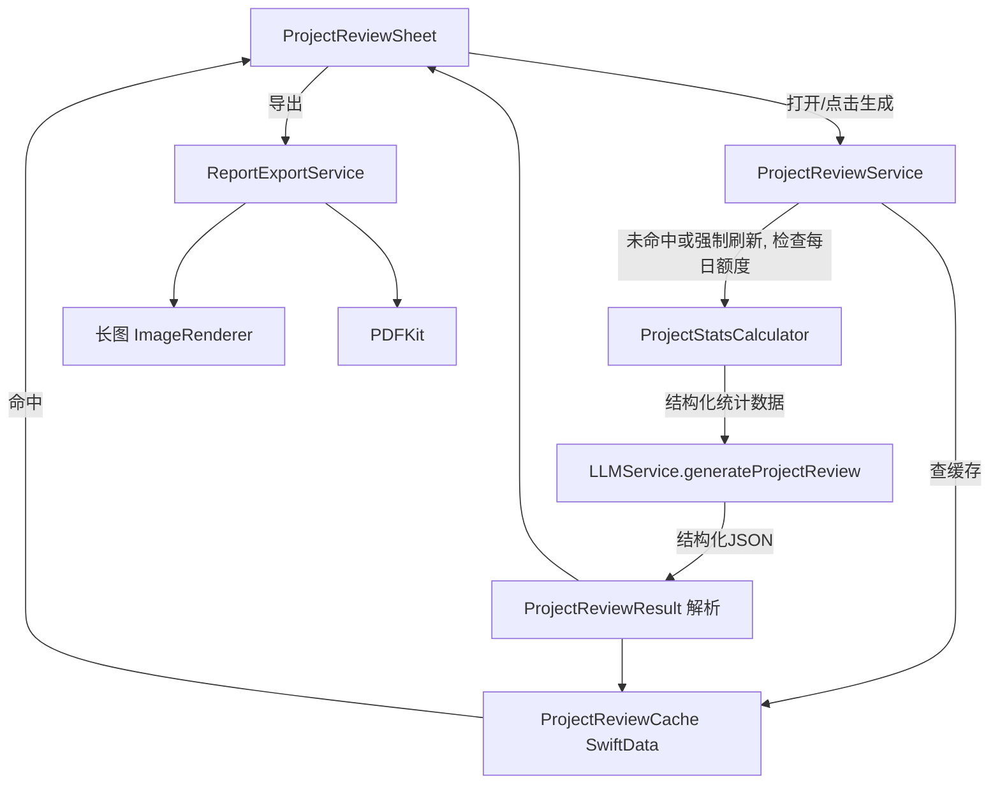

# AI 复盘总结系统开发计划

## 现状基线（已确认）

- 复盘 UI 骨架已存在：[moneyfull_ios/Views/ProjectReviewSheet.swift](moneyfull_ios/Views/ProjectReviewSheet.swift)，含 `basicDataCard`、`budgetSummaryCard`、`aiSummaryCard`（`ProLockedSection` 包裹）、`nextBudgetCard`、`exportCard`（TODO 空实现）。
- AI 调用已存在但数据薄：[moneyfull_ios/Services/LLMService.swift](moneyfull_ios/Services/LLMService.swift) 的 `generateProjectReview(project:mode:)`（约 525-630 行），生活模式传 5 点、搞钱模式传 7 点，返回扁平 `summary` 字符串 + `next_budget`，与 PRD 描述完全一致。
- `Project`（[moneyfull_ios/Models/Models.swift](moneyfull_ios/Models/Models.swift)）已具备绝大部分计算属性：`totalSpent/budget/budgetProgress/totalDays/dailyAvgSpend/totalIncome/netProfit/roi/totalTimeCost/totalCost/totalHourEquivalent/effectiveHourlyRate/effectiveWorkingDays/totalFixedCosts`，以及关系 `transactions/budgetItems/timeEntries/fixedCosts/receivables`。
- 大件消费关键词已有：`ProjectTypeConfigManager.shared.getConfig(name:description:).bigItemKeywords`（[moneyfull_ios/Models/ProjectTypeConfig.swift](moneyfull_ios/Models/ProjectTypeConfig.swift)）。
- Pro 遮罩组件已有：`ProLockedSection`（[moneyfull_ios/Components/PlusLockedSection.swift](moneyfull_ios/Components/PlusLockedSection.swift)）。
- 次数限制模式可参考：`StoreManager`（[moneyfull_ios/Services/StoreManager.swift](moneyfull_ios/Services/StoreManager.swift)）的 `dailyUsageCount` / `todayUsageKey`（`UserDefaults` 按日期 key）/ `consumeOneCall()`，但这是 AI 聊天专用额度，复盘需要**独立的**每日额度 key。
- SwiftData 模型统一在 `Models.swift`，容器注册在 [moneyfull_iosApp.swift](moneyfull_ios/moneyfull_iosApp.swift)（3 处 `ModelContainer` 初始化都要同步加新模型，否则某条路径漏注册会崩）。
- 无 `ProjectReviewCache`、无历史项目相似度匹配、无 `ImageRenderer`/PDF 导出实现——这些都需要新建。
- 历史对比维度（V1 跳过）：不接入本轮 Prompt/UI，`ProjectStatsCalculator` 暂不实现该维度，为未来预留字段命名空间但不强制交付。

## 整体数据流（目标态）



## Phase 1：数据预计算层

新建 `moneyfull_ios/Services/ProjectStatsCalculator.swift`：

- 数据结构：`LifestyleProjectStats`、`EarningProjectStats`、`CategoryBudgetExecution`（对应 PRD 6.1，去掉 `historicalComparison` 字段或保留为 `nil` 占位不使用）。
- 生活模式计算：
  - 分类预算执行拆解：遍历 `project.budgetItems`，按 `categoryName` 过滤 `project.transactions` 中 `.expense` 求和，算 `ratio`/`status`/`delta`（复用 PRD 6.2 `calculateCategoryBudgetExecution` 逻辑）。
  - HHI 指数：按分类分组求份额平方和，映射 `分散/中等集中/高度集中` 标签。
  - 大件 vs 日常：调用 `ProjectTypeConfigManager.shared.getConfig(name: project.name, description: project.desc).bigItemKeywords` 过滤支出。
  - 单笔分布：max/avg/median/波动系数。
  - 时间维度：前后半段占比、消费高峰日、日均记账笔数。
- 搞钱模式计算：盈利能力（利润率、ROI 评级、目标达成率，用 `project.targetIncome`）、时间价值（真实时薪评级、日均工时、前后半段工时——用 `project.timeEntries` 按日期分组）、成本结构（时间成本占比、最大支出项贡献度、`project.totalFixedCosts`）、经营效率（收入/支出前后半段节奏、月度净现金流）。
- 全部计算用 Swift 原生（无第三方库），边界情况处理：空数组、除零保护、`totalDays == 0` 等（对应 PRD 十四风险表「数据量过少」——设置 `transactions.count >= 5` 才触发 AI 洞察生成，否则 UI 提示"记录较少，暂不生成深度分析"）。

## Phase 2：AI Prompt 重构与结构化输出

改造 `LLMService.generateProjectReview`（[moneyfull_ios/Services/LLMService.swift:525](moneyfull_ios/Services/LLMService.swift)）：

- 输入改为接收 `LifestyleProjectStats` / `EarningProjectStats`（由调用方先跑 `ProjectStatsCalculator` 算好再传入，保持 LLMService 不直接依赖统计计算逻辑，职责分离）。
- 按 PRD 5.2/5.3 重写系统 Prompt 模板，要求返回 `highlights`（4 条，带 icon/label/text）+ `one_liner` + `next_budget`（生活模式）/`next_quote`（搞钱模式，额外报价建议）。
- 新增/替换输出模型（放在新文件 `moneyfull_ios/Models/ProjectReviewModels.swift`，替换 `LLMService.swift` 末尾原有的元组式 `ProjectReviewResult`）：
  - `InsightHighlight { icon, label, text }`
  - `BudgetSuggestion { name, amount, reason }`
  - `QuoteSuggestion { suggestedAmount, reason }`
  - `ProjectReviewResult { highlights, oneLiner, nextBudgetSuggestions, nextQuoteSuggestion }`（Codable，便于缓存序列化）
- JSON 解析加固：先去除 ```json 代码块围栏再解析；金额字段用 `NSNumber`/`Decimal` 兜底避免 `Int` 返回时 `as? Double` 丢失（修复现有 bug，[moneyfull_ios/Services/LLMService.swift:625](moneyfull_ios/Services/LLMService.swift)）；解析失败时返回带默认文案的降级结果而不是直接抛错到 UI 空白。

## Phase 3：UI 组件与复盘页升级

- 新增 `moneyfull_ios/Components/AIInsightCard.swift`：洞察卡片组件（对应 PRD 7.2）。
- 新增 `moneyfull_ios/Components/CategoryBudgetBar.swift`：分类预算执行进度条（对应 PRD 7.3），复用现有 `Color.App.*` 主题色和 `Color(hex:)`。
- 改造 [moneyfull_ios/Views/ProjectReviewSheet.swift](moneyfull_ios/Views/ProjectReviewSheet.swift)：
  - `basicDataCard`/`budgetSummaryCard` 保持免费展示，`budgetSummaryCard` 增加分类级别 `CategoryBudgetBar` 列表（免费，不含 AI 文案，纯数据展示，提升免费用户"看到真实数字"的钩子效果，对应 PRD 11.2 转化逻辑）。
  - `aiSummaryCard` 改为渲染 `result.highlights` 为 `AIInsightCard` 列表 + `oneLiner`（仍包在现有 `ProLockedSection` 内，遮罩逻辑不变）。
  - `nextBudgetCard` 保持展示 `nextBudgetSuggestions`，搞钱模式额外展示 `nextQuoteSuggestion`。
  - 生成按钮逻辑改为调用 `ProjectReviewService`（见 Phase 4）而不是直接调 `LLMService`。

## Phase 4：本地缓存与每日额度

- 新增 SwiftData 模型 `ProjectReviewCache`（放入 `Models.swift`，与其他 `@Model` 一致风格）：`id, projectID, resultJSON, createdAt, dataHash`。
- 在 [moneyfull_iosApp.swift:21,36,51](moneyfull_ios/moneyfull_iosApp.swift) 三处 `ModelContainer(for:...)` 同步加入 `ProjectReviewCache.self`（务必三处都加，否则某个 fallback 路径会因 schema 不一致崩溃）。
- 新建 `moneyfull_ios/Services/ProjectReviewService.swift`：
  - `getReviewResult(project:mode:forceRefresh:modelContext:) async throws -> ProjectReviewResult`：先查缓存直接返回（不自动比对数据是否变化、不自动刷新），否则检查额度→调用 `ProjectStatsCalculator` + `LLMService`→写缓存。
  - 每日额度：独立于 AI 聊天额度，新增 `UserDefaults` key（如 `ai_review_usage_yyyy-MM-dd`，仿 `StoreManager.todayUsageKey` 命名规范但物理隔离），免费用户 0 次/天、Pro 1 次/天（所有项目共享），复用 `StoreManager.isPremium` 判断。
  - `isDataUpdated(project:modelContext:) -> Bool`：用简单指纹（交易数+总额+预算+分类数拼接）判断是否提示"数据已更新"，仅提示不自动刷新。
  - `ReviewError` 枚举：`.proRequired` / `.dailyLimitReached`，对应 UI 文案。
- `ProjectReviewSheet` 接入：显示"数据已更新"提示条、刷新按钮（仅有缓存时出现）、次数用尽时展示对应错误态（对应 PRD 9.5 UI 状态机）。

## Phase 5：导出长图 / PDF

- 新建 `moneyfull_ios/Views/ProjectReviewReportView.swift`：固定宽度导出布局（品牌头部+项目概览+核心数字+AI 洞察+一句话总结+建议+品牌footer），复用 `Color.App`、`progressColorPair`、`AppIconView` 等现有主题工具，避免重复定义样式。
- 新建 `moneyfull_ios/Services/ReportExportService.swift`：`exportAsImage`（`ImageRenderer`，`scale = 3.0`）、`exportAsPDF`（复用图片渲染结果转 `UIGraphicsPDFRenderer`）、`saveToPhotos`、`saveToFile`。
- 接入 `exportCard`（[moneyfull_ios/Views/ProjectReviewSheet.swift:319](moneyfull_ios/Views/ProjectReviewSheet.swift)）：替换现有 TODO，接 `confirmationDialog` 选择"长图/PDF"，PDF 走分享面板（可复用 [moneyfull_ios/Views/ExportConfigSheet.swift](moneyfull_ios/Views/ExportConfigSheet.swift) 中已有的 `ShareSheet`/`UIActivityViewController` 封装，不重新造轮子）；导出按钮 disabled 条件改为 `reviewResult == nil`。

## Phase 6：联调、边界与验收

- 边界：交易数 < 5 时不生成 AI 深度洞察（提示文案兜底）；`totalDays == 0`/`budget == 0` 等除零保护单测覆盖 `ProjectStatsCalculator` 核心方法。
- LLM 输出稳定性：为 JSON 解析失败设计降级 UI（而不是空白/崩溃），复测生活/搞钱两种模式各若干真实项目数据。
- 深色模式与 iPhone SE / Pro Max 尺寸下的洞察卡片、导出长图视觉检查。
- 对照 PRD 十三节验收标准逐项检查（数据准确性、AI 输出质量、UI 展示、性能）。

## 关键风险与取舍

- **历史对比维度 V1 跳过**：生活模式 AI 洞察为 4 张卡（预算执行/消费结构/消费节奏/最佳表现，对齐 PRD 7.1 UI 示例本身也是这 4 张而非历史对比），避免引入不成熟的"相似项目匹配"算法。
- **额度隔离**：复盘每日额度必须与 AI 聊天额度用不同 `UserDefaults` key，否则会互相消耗，需要在实现时特别注意。
- **ModelContainer 三处注册**：新增 `ProjectReviewCache` 必须同步改 CloudKit/本地/内存三个初始化分支。
- **JSON 解析健壮性**：当前实现对 LLM 返回的 markdown 代码块围栏和整型金额无兜底，Phase 2 必须修复，否则结构化输出的达标率无法满足 PRD「解析成功率 > 95%」的验收标准。
