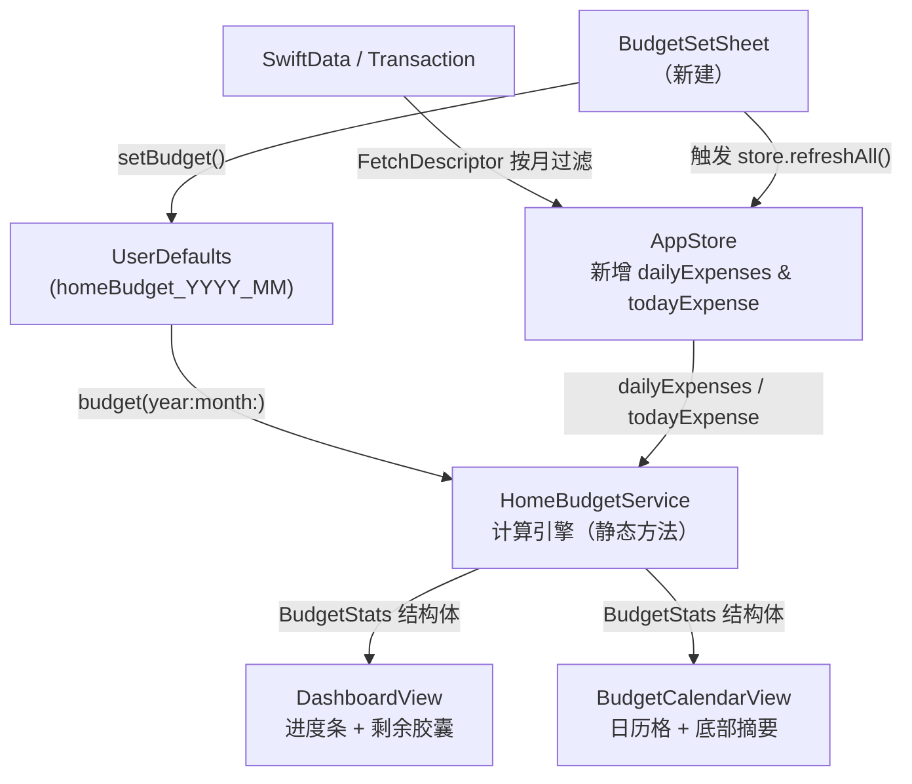

# Phase 2 & 3：数据层 + UI 联通

## 整体数据流



---

## Phase 2：数据层

### Step 2.1 — 新建 `HomeBudgetService.swift`

- **路径**: `moneyfull_ios/Services/HomeBudgetService.swift`
- **核心内容**:
  - `budget(year:month:) -> Double?` — 读 UserDefaults key `homeBudget_YYYY_MM`
  - `setBudget(_:year:month:)` — 写 UserDefaults
  - `BudgetStats` 结构体 — 聚合所有计算结果（无副作用，纯值类型）
  - `calcStats(budget:dailyExpenses:todayExpense:referenceDate:) -> BudgetStats` — 实现第十七节所有公式

- **BudgetStats 包含字段**:
  - `dailyBudget`, `remainingBudget`, `budgetProgress`, `timeProgress`
  - `paceDifference` (百分点差值，用于 5 档判断)
  - `paceLabel: String` — 文案（"节奏正常" / "稍微偏快" 等）
  - `isAlert: Bool` — 胶囊颜色控制（差 > +10 个百分点时为红/橙）
  - `projectedMonthlyExpense: Double?` — 月初 ≤7 天时为 `nil`
  - `dynamicDailyBudget`, `todayRemainingSpend`
  - `cumulativeExpense: Double` — 截至今日累计
  - `averageDailyExpense: Double`

- **节奏档位** (与功能逻辑文档第十二节对齐):

  | 差值（百分点） | 文案 | isAlert |
  |---|---|---|
  | ≤ −10 | 花得比较省 | false |
  | −10 ～ +10 | 节奏正常 | false |
  | +10 ～ +20 | 稍微偏快 | true |
  | +20 ～ +35 | 花得有点快 | true |
  | > +35 | 预算告急 | true |
  | 使用率 ≥ 100% | 已超预算 | true |

### Step 2.2 — 扩展 `AppStore.swift`

在 [`moneyfull_ios/Models/AppStore.swift`](moneyfull_ios/Models/AppStore.swift) 新增以下方法（不改动现有代码）：

```swift
/// 返回指定年月的 [日序号: 当日支出合计]
func dailyExpenses(year: Int, month: Int) -> [Int: Double]

/// 返回今日支出合计（与现有 monthlyExpense 口径一致，只统计 .expense 类型）
func todayExpense() -> Double
```

- `dailyExpenses` 用 `FetchDescriptor` 按月范围过滤 Transaction，一次遍历按日分组求和，与现有 `calcMonthlyStats()` 相同的过滤口径（只统计 `.expense`，金额取 `abs`）
- 结果不缓存到 `@Published`（避免额外内存），按需调用；如性能问题后续可加缓存

---

## Phase 3：UI 联通

### Step 3.1 — BudgetCalendarView 接入真实数据

文件: [`moneyfull_ios/Components/BudgetCalendarView.swift`](moneyfull_ios/Components/BudgetCalendarView.swift)

- 新增初始化参数: `@EnvironmentObject var store: AppStore`
- **移除文件顶部的 Phase 1 Mock 常量**（`mockDailyExpenses`, `mockMonthlyBudget` 等）
- `displayMonth` 切换时，调用 `store.dailyExpenses(year:month:)` 计算当月数据
- 从 `HomeBudgetService.budget(year:month:)` 读取月预算，算出 `dailyBudget`
- 底部摘要 5 个字段全接 `BudgetStats` 真实值
- `PacePill` 的 `text` / `isAlert` 接 `BudgetStats.paceLabel` / `isAlert`
- **翻月逻辑**（不同月显示不同摘要）:
  - 当前月：完整逻辑（截至今日累计 / 本月预计）
  - 历史月：整月实际支出 / 月预算 / 结余 or 超支（底部摘要字段 label 相应变化）
  - 未来月：底部摘要显示「暂无消费记录」占位

### Step 3.2 — DashboardView 进度条接真实数据

文件: [`moneyfull_ios/Views/DashboardView.swift`](moneyfull_ios/Views/DashboardView.swift)

- 替换硬编码的 `0.54`、`"54%"`、`"本月已过 53%"` 等文案
- 「今日可花」`FinanceInfoCard` 的 `value: 195` → `store.todayRemainingSpend`（由 `BudgetStats` 提供）
- 「剩余 ¥2,384」胶囊 → `BudgetStats.remainingBudget`
- 若用户从未设置预算，进度条区域显示 "尚未设置本月预算" 引导文案（点击弹出 Sheet）

### Step 3.3 — 新建预算设置 Sheet

**新建文件**: `moneyfull_ios/Components/BudgetSetSheet.swift`

功能:
- 显示当前月预算（若有）
- 数字键盘输入新预算，`@FocusState` 管理
- 确认按钮 → `HomeBudgetService.setBudget()` → `store.refreshAll()`（利用现有 `dataVersion` 触发刷新）
- 未设置状态：引导文案 + 金额输入框
- 已设置状态：当前金额 + 「修改」按钮
- 点击「剩余 ¥XXX」胶囊触发此 Sheet（`@State private var isBudgetSheetPresented = false`）

---

## 文件改动清单

- `moneyfull_ios/Services/HomeBudgetService.swift` — **新建**（Phase 2）
- `moneyfull_ios/Models/AppStore.swift` — **扩展**，新增 2 个方法（Phase 2）
- `moneyfull_ios/Components/BudgetCalendarView.swift` — **修改**，移除 Mock，接真实数据（Phase 3）
- `moneyfull_ios/Views/DashboardView.swift` — **修改**，进度条 + 胶囊接真实数据（Phase 3）
- `moneyfull_ios/Components/BudgetSetSheet.swift` — **新建**，预算设置弹窗（Phase 3）

SwiftData Schema 不动，现有用户数据完全安全。
