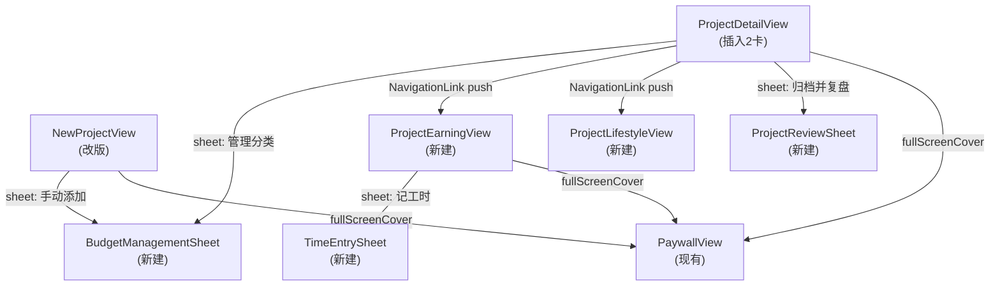

# UI 优先落地：项目预算 & 经营看板

## 现有基础

- [`ProjectDetailView.swift`](moneyfull_ios/Views/ProjectDetailView.swift) - ScrollView 目前有 4 张卡：概览 → 分类占比 → 收支趋势 → 账单时间轴，需插入 2 张新卡
- [`NewProjectView.swift`](moneyfull_ios/Views/NewProjectView.swift) - 纯表单，需增加模式选择和预算规划区块
- `PaywallView` 以 `fullScreenCover` 呈现，`ProjectDetailView` 目前只有 `.alert`，无 `showPaywall` state
- `StoreManager.isPremium` 通过 `@EnvironmentObject` 在所有视图可用

## Stub 约定

所有新视图用本地结构体驱动，无 SwiftData 依赖：

```swift
struct BudgetItemUI: Identifiable {
    var id = UUID()
    var categoryName: String
    var categoryIcon: String
    var categoryColorHex: String
    var amount: Double
    var alertThreshold: Double = 0
}

struct TimeEntryUI: Identifiable {
    var id = UUID()
    var duration: Double
    var granularity: String  // "hour" | "day"
    var rate: Double
    var note: String
    var date: Date
}
```

## 视图架构概览



## Phase UI-1: Stub 结构体 + 共用组件（新建文件）

**新建** `moneyfull_ios/Components/BudgetUITypes.swift`
- 定义 `BudgetItemUI`、`TimeEntryUI` stub 结构体，附带预置 mock 数据静态方法

**新建** `moneyfull_ios/Components/BudgetProgressRow.swift`
- 单行预算分类进度条组件：图标、名称、金额、进度条、百分比
- 超警线时条变红，复用 `progressColorPair(for:)` 同款颜色逻辑

**新建** `moneyfull_ios/Components/PlusLockedSection.swift`
- 通用 Plus 锁定包装器：`content` + `lockedOverlay` 参数
- 支持两种形态：模糊遮罩（有真实内容）和 入口锁定卡（无内容时功能说明）

## Phase UI-2: NewProjectView 改版

修改 [`NewProjectView.swift`](moneyfull_ios/Views/NewProjectView.swift)，在总预算字段之后插入：

1. **项目模式选择** - 两张并列卡片，`@State private var projectMode = "lifestyle"`
   - 灰色提示文字：`"根据「{name}」，建议选生活模式"`（纯本地字符串判断，不调 LLM）
2. **预算规划区块**（当 `budgetText` 非空时展开）
   - `[✨ AI 生成 🔒 Plus]` 按钮：`storeManager.isPremium` ? 触发 stub 生成 : `showPaywall = true`
   - `[手动添加分类]` 按钮：展开 `BudgetManagementSheet`
   - 已生成的 `BudgetItemUI` 列表，左滑删除，点击编辑金额
   - 底部实时显示「已分配 ¥X / 未分配 ¥Y」
3. **预算周期** - 三选一 Picker（整个项目 / 按月 / 自定义天数）
4. **预算预警** - `PlusLockedSection` 包装，免费用户遮罩

## Phase UI-3: ProjectDetailView 插入 2 张新卡

修改 [`ProjectDetailView.swift`](moneyfull_ios/Views/ProjectDetailView.swift)：

**新增 @State 变量：**
```swift
@State private var showPaywall = false
@State private var showBudgetManagement = false
@State private var showArchiveReview = false
@State private var navigateToEarningDashboard = false
@State private var navigateToLifestyleDashboard = false
```

**ScrollView VStack 插入位置：**
```
① 项目概览卡片（现有）
② 【新增】budgetCategoryCard    ← 插在概览和分类占比之间
③ 分类占比卡片（现有）
④ 收支趋势卡片（现有）
⑤ 【新增】dashboardEntryCard    ← 插在趋势图和账单时间轴之间
⑥ 账单时间轴（现有）
```

- `budgetCategoryCard`：用 mock `BudgetItemUI` 数组驱动，「管理分类 ›」打开 `BudgetManagementSheet`
- `dashboardEntryCard`：根据 `projectMode` 显示经营看板或预算防线入口，`NavigationLink` push
- **··· 菜单**：「归档项目」改为「归档并复盘」，触发 `showArchiveReview = true`
- **新增 modifier**：`.fullScreenCover(isPresented: $showPaywall) { PaywallView() }`
- **新增 NavigationLink**：到 `ProjectEarningView` 和 `ProjectLifestyleView`

## Phase UI-4: BudgetManagementSheet

**新建** `moneyfull_ios/Views/BudgetManagementSheet.swift`
- 标题 + 「完成」按钮
- 分类列表（`BudgetProgressRow`），左滑删除，点击进入编辑
- 底部「+ 添加分类」行 → 内嵌 inline 表单（图标、名称、金额输入）
- 已分配 / 未分配 实时汇总
- 预算周期选择器
- 预算预警设置（`PlusLockedSection` 包装）

## Phase UI-5: ProjectEarningView（经营看板全页）

**新建** `moneyfull_ios/Views/ProjectEarningView.swift`

复用 `ProjectDetailView` 同款导航栏（返回 + 标题 + 菜单）。页面结构（全 mock 数据）：
1. **真实时薪**（最大字号）+ 目标对比差距
2. **收支总览** - 3格（总收入 / 总成本 / 净利润）+ ROI% + 目标收入进度条
3. **时间投入** - 累计工时 + 周折线图（复用现有 `AreaChartView`）+ 「+ 记工时」按钮
4. **成本结构** - 甜甜圈图（复用现有 `DonutChartView`）
5. **趋势月环比** - `PlusLockedSection` 包装
6. **AI 洞察** - `PlusLockedSection` 包装

「+ 记工时」按钮 → `sheet: TimeEntrySheet`

## Phase UI-6: ProjectLifestyleView（预算防线全页）

**新建** `moneyfull_ios/Views/ProjectLifestyleView.swift`

页面结构（全 mock 数据）：
1. **预算剩余**（最大字号）+ 渐变进度条（绿→黄→红）+ IP 点评文字区域
2. **大件 vs 日常**（免费用户可见基础）：旅行大件 / 日均自由消费 → `PlusLockedSection`
3. **分类占比** - 复用 `DonutChartView`
4. **每日消费走势** - 折线图 → `PlusLockedSection`

## Phase UI-7: ProjectReviewSheet（复盘 Sheet）

**新建** `moneyfull_ios/Views/ProjectReviewSheet.swift`

- 大标题「《{项目名} · 旅行账单》」
- **基础数字区**（免费）：总花费 / 预算对比 / 天数 / 日均 / 最大超支分类
- **AI 总结区**：`PlusLockedSection` 遮罩，内含真实数字但 AI 文字模糊
- **下次建议区**：`PlusLockedSection` 遮罩
- 底部：「导出精美图片 🔒 Plus」按钮 + 「确认归档」按钮

搞钱模式 vs 生活模式通过传入 `projectMode` 参数切换内容结构。

## Phase UI-8: TimeEntrySheet（记工时 Sheet）

**新建** `moneyfull_ios/Views/TimeEntrySheet.swift`

- 按小时 / 按天 切换 Segmented Picker
- 工时数字输入（自定义数字键盘或 `.decimalPad`）
- 时薪/日薪输入（默认值来自传入参数）
- 任务描述文本框
- 日期选择
- 底部「成本预览 ¥XXX」实时计算 + 「保存」按钮（UI-first 阶段 save 为 no-op）

## 文件变更汇总

| 操作 | 文件 |
|---|---|
| 新建 | `Components/BudgetUITypes.swift` |
| 新建 | `Components/BudgetProgressRow.swift` |
| 新建 | `Components/PlusLockedSection.swift` |
| 新建 | `Views/BudgetManagementSheet.swift` |
| 新建 | `Views/ProjectEarningView.swift` |
| 新建 | `Views/ProjectLifestyleView.swift` |
| 新建 | `Views/ProjectReviewSheet.swift` |
| 新建 | `Views/TimeEntrySheet.swift` |
| 修改 | `Views/NewProjectView.swift` |
| 修改 | `Views/ProjectDetailView.swift` |

共新建 8 个文件，修改 2 个已有文件。全程不触碰 `Models.swift`、`AppStore.swift`、`LLMService.swift`、`StoreManager.swift`。
