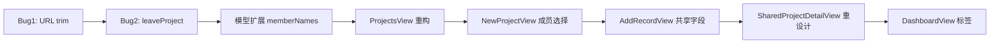

# 共享记账 UI 升级落地

## 改动文件总览

- [`Services/SharedProjectService.swift`](moneyfull_ios/Services/SharedProjectService.swift) — Bug 修复
- [`Models/SharedModels.swift`](moneyfull_ios/Models/SharedModels.swift) — 模型扩展
- [`Views/ProjectsView.swift`](moneyfull_ios/Views/ProjectsView.swift) — 核心入口重构
- [`Views/NewProjectView.swift`](moneyfull_ios/Views/NewProjectView.swift) — 成员类型选择器
- [`Views/AddRecordView.swift`](moneyfull_ios/Views/AddRecordView.swift) — 共享字段条件展示
- [`Views/SharedProjectDetailView.swift`](moneyfull_ios/Views/SharedProjectDetailView.swift) — 详情页重设计
- [`Views/DashboardView.swift`](moneyfull_ios/Views/DashboardView.swift) — 首页卡片标签

---

## Bug 1 — URL 空格导致 invalidURL

**根因**：`JoinProjectView` 输入的邀请码末尾带空格/换行，拼入 URL 后非法，抛出 `NetworkError.invalidURL`。

**修复位置**：`SharedProjectService.swift` 中 `fetchTransactions`、`writeTransactions`、`deleteTransaction`、`leaveProject` 四个方法，在构建 path 前对 `inviteCode` 加 `.trimmingCharacters(in: .whitespacesAndNewlines)`。`JoinProjectView` 调用前也做 trim（双重保障）。

---

## Bug 2 — leaveProject 退出后列表不刷新

**根因**：`leaveProject` 内 `joinedProjects.filter { $0.inviteCode != inviteCode }` 逻辑正确，但退出后 `SharedProjectListView` 没有被通知重新加载（`onAppear` 在导航返回时不重触发）。

**修复**：

```swift
// SharedProjectService.swift
func leaveProject(inviteCode: String) async throws {
    let trimmed = inviteCode.trimmingCharacters(in: .whitespacesAndNewlines)
    let _: SimpleResponse = try await request(method: "DELETE", path: "/\(trimmed)/members/\(deviceId)")
    // 用 projectId 而非 inviteCode 查找删除，语义更准确
    if let projectId = joinedProjects.first(where: { $0.inviteCode == inviteCode })?.projectId {
        removeJoinedProject(projectId: projectId)
    }
    NotificationCenter.default.post(name: .sharedProjectsDidUpdate, object: nil)
}

// 新增通知 name
extension Notification.Name {
    static let sharedProjectsDidUpdate = Notification.Name("sharedProjectsDidUpdate")
}
```

---

## 模型扩展 — JoinedSharedProject 加 memberNames

`SharedModels.swift` 中 `JoinedSharedProject` 加一个字段和两个计算属性：

```swift
var memberNames: [String]           // 所有成员昵称（含自己）

var memberCount: Int { memberNames.count }
var membersDisplay: String { memberNames.joined(separator: " · ") }
```

同步更新 `SharedProjectService.swift` 的保存逻辑：
- `joinProject` 时存 `response.members.map { $0.participantName }`
- `createProject` 时存 `[creatorName]`

---

## ProjectsView — 移除独立入口，整合共享项目到列表

**当前**：Banner 卡片 `NavigationLink -> SharedProjectListView()` 占据列表顶部（line 40-70）。

**改后**：

```
[AppLogo]  项目中心  [person.badge.plus 加入项目]  [slider.horizontal.3 管理]
```

- 删除 Banner 卡片
- 工具栏右一：`person.badge.plus`，点击弹出 `JoinProjectView` Sheet
- 工具栏右二：原 `slider.horizontal.3` 管理按钮保持

项目列表逻辑：加载 `SharedProjectService.shared.joinedProjects`，个人项目 + 共享项目在同一 `VStack` 渲染：

```swift
// 个人项目（现有逻辑不变）
ForEach(projects) { project in
    ProjectDetailCard(project: project, ...)   // 加「个人」小标签
}
// 共享项目（新增）
ForEach(sharedProjects) { sp in
    NavigationLink(value: sp) {
        SharedProjectDetailCard(project: sp)   // 新组件，见下
    }
}
```

**`ProjectDetailCard` 改动**：项目名旁加「个人」Capsule 小标签（灰色，复用现有 Capsule 样式）。

**新增 `SharedProjectDetailCard`**：蓝色人物图标 + 项目名 + `「共享·N人」` 蓝色标签 + 成员昵称行 + `查看详情` 按钮，视觉与 `ProjectDetailCard` 统一风格。

监听 `.sharedProjectsDidUpdate` 通知刷新列表。

---

## NewProjectView — 项目成员选择器

在「项目模式」section 之后插入「项目成员」section，UI only（不接入服务端创建）：

```
项目成员
  [ 仅自己 ]      [ 邀请成员 ]
  个人项目         和家人、朋友
  仅自己可见        一起记账

  （选「邀请成员」时显示）：
  创建后会生成 6 位邀请码，分享给成员即可加入，无需填写成员信息
```

---

## AddRecordView — 条件展示共享字段

`selectedProject` 匹配到 `SharedProjectService.shared.joinedProjects` 时，在备注行之前条件插入三行：

```
付款人    [我 ▼]         ← Menu，选项为该共享项目的 memberNames
参与人    [全部 N 人]    ← 纯展示，V2 再做多选
分摊方式  [平均分摊]     ← 纯展示，V2 再做自定义
```

新增三个 `@State`：`payerName: String`、`selectedParticipants: [String]`、`splitMethod: String = "equal"`，当前不接入提交逻辑。

---

## SharedProjectDetailView — 完整重设计

从 `List` 改为 `ScrollView`，三个 section，数据加载逻辑保持不变：

```
ScrollView
  ├── headerSection       项目名 / 成员昵称 / 总支出金额
  ├── memberStatsSection  各成员「付了 ¥X」（按 participantName 聚合）
  └── transactionListSection  按日期分组，每行「Tim 支付·3人参与」格式
```

`toolbar` 改为 `···` Menu，包含：记一笔、邀请成员（显示邀请码 Sheet）、刷新同步、退出共享账本。

---

## DashboardView — 首页卡片标签 + 共享项目

`ProjectCard`（line 691）将 `Text("进行中")` 改为 `Text("个人")`，样式不变。

横向滑动区 `LazyHStack` 末尾追加 `SharedProjectSmallCard` 组件（仿 `ProjectCard` 外形，蓝色图标 + 「共享·N人」标签）。

---

## 执行顺序


