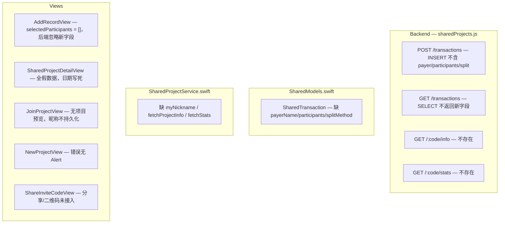
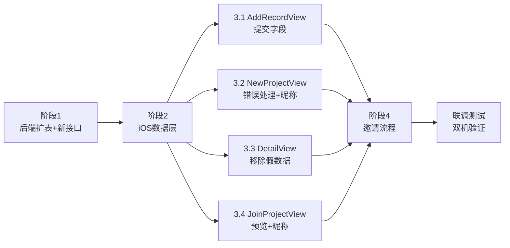

# 共享记账逻辑接入落地

## 现状诊断



---

## 阶段一：后端扩展（约 1 天）

### 1.1 ALTER TABLE 新增三字段

在 `originapex-shared-service` 执行：

```sql
ALTER TABLE mf_shared_transactions
  ADD COLUMN payer_name   VARCHAR(50)  NULL            AFTER participant_name,
  ADD COLUMN participants JSON         NULL            AFTER payer_name,
  ADD COLUMN split_method VARCHAR(20)  DEFAULT 'equal' AFTER participants;
```

### 1.2 更新 [sharedProjects.js](originapex-shared-service/src/routes/sharedProjects.js)

- `POST /:inviteCode/transactions` — INSERT 语句加入三字段（`req.body` 中可选，缺省 NULL）
- `GET /:inviteCode/transactions` — SELECT 列表补充 `payer_name, participants, split_method`

### 1.3 新增 `GET /:inviteCode/info` 路由（加入前预览）

```js
// 返回项目名 + 成员列表，不需要 device_id 鉴权
SELECT p.name, m.participant_name, m.joined_at
  FROM mf_shared_projects p
  JOIN mf_shared_project_members m ON p.id = m.project_id
 WHERE p.invite_code = ? AND p.is_deleted = 0
```

### 1.4 新增 `GET /:inviteCode/stats` 路由（成员统计）

```js
// totalPaid：payer_name = name 的金额之和
// totalConsumed：JSON_CONTAINS(participants, '"name"') 的金额 / JSON_LENGTH(participants) 之和
// 旧数据（payer_name NULL）降级用 participant_name
```

---

## 阶段二：iOS 数据层（约 0.5 天）

### 2.1 [SharedModels.swift](moneyfull_ios/Models/SharedModels.swift)

`SharedTransaction` 新增三个可选字段（`decodeIfPresent` 向后兼容旧数据）：

```swift
let payerName: String?       // 付款人
let participants: [String]?  // 参与人列表
let splitMethod: String?     // 分摊方式

// 计算属性
var displayPayerName: String { payerName ?? participantName ?? "未知" }
var displayParticipantsText: String { ... }  // "N人参与" or "全体成员"
```

新增 `MemberStat` / `ProjectStatsResponse` / `ProjectInfoResponse` 三个 Codable 结构。

### 2.2 [SharedProjectService.swift](moneyfull_ios/Services/SharedProjectService.swift)

新增三项：

```swift
var myNickname: String { get set }  // 读写 UserDefaults["sharedNickname"]

func fetchProjectInfo(inviteCode: String) async throws -> ProjectInfoResponse
func fetchStats(inviteCode: String) async throws -> ProjectStatsResponse
```

---

## 阶段三：iOS 核心功能接入（约 3 天）

### 3.1 [AddRecordView.swift](moneyfull_ios/Views/AddRecordView.swift)（1 天）

- `onAppear`：`payerName` 初始化读 `SharedProjectService.shared.myNickname`，`selectedParticipants` 初始化为 `sp.memberNames`（全员）
- 付款人选择：`.confirmationDialog` 列出 `sp.memberNames`，点击更新 `payerName`
- `handleSave()` 中写入字典：`participants` 由 `selectedParticipants` 转 JSON Array（已有框架，补全即可）

### 3.2 [NewProjectView.swift](moneyfull_ios/Views/NewProjectView.swift)（0.5 天）

- 创建失败：`catch` 分支弹 Alert（当前只有 `print`）
- 创建成功：`SharedProjectService.shared.myNickname = creatorName` 写入 UserDefaults

### 3.3 [SharedProjectDetailView.swift](moneyfull_ios/Views/SharedProjectDetailView.swift)（1 天）

- `displayTransactions`：删除 fakeTx1/2/3，空数据时显示"还没有任何记录"空态 UI
- `statsCard` 总支出：删除 `totalAmount == 0 ? 4320` 分支，直接用 `totalAmount`
- `statsCard` 成员分栏：从 `transactions` 按 `displayPayerName` 分组累加（本地计算），无数据时显示项目成员列表 `¥0`
- `headerSection` 日期：从 `transactions` 求 min/max `transactionAt`，无数据时显示项目加入日期（`project.lastSyncTime` fallback）
- `getIcon()` 扩展：补充完整分类 icon 映射（复用 `AddRecordView` 已有的 category 列表）

### 3.4 [JoinProjectView.swift](moneyfull_ios/Views/JoinProjectView.swift)（0.5 天）

- 当前：输入码 + 昵称 → 直接 join
- 改为：输入6位码后先调 `fetchProjectInfo()` 展示项目名 + 成员列表预览，确认后才调 `joinProject()`
- 加入成功：`SharedProjectService.shared.myNickname = participantName` 写入 UserDefaults
- UI 升级：从 `Form` 改为与当前 App 风格一致的自定义样式（参考 `NewProjectView` 的卡片布局）

---

## 阶段四：邀请流程（约 1 天）

### 4.1 [ShareInviteCodeView.swift](moneyfull_ios/Views/ShareInviteCodeView.swift)

- 系统分享：`UIActivityViewController(activityItems: [shareText])`，通过 `UIViewControllerRepresentable` 桥接
- 二维码（新建 `Utils/QRCodeHelper.swift`）：

```swift
// CIFilter("CIQRCodeGenerator") 生成，无需第三方库
static func generate(from string: String, size: CGFloat = 200) -> UIImage?
```

- 邀请文本："邀请码 XXXXXX，加入「项目名」共享账本，打开钱小满 App 即可使用"

### 4.2 URL Scheme 深链接

- `Info.plist` 注册 `CFBundleURLSchemes: ["moneyfull"]`
- App 入口（`moneyfull_iosApp.swift`）：`.onOpenURL { url in ... }` 解析 `moneyfull://join?code=XXXXXX`，弹出预填邀请码的 `JoinProjectView`

---

## 执行顺序



## 改动文件总览

| 文件 | 类型 | 改动规模 |
|------|------|---------|
| `sharedProjects.js` | 后端 | ALTER TABLE + 2条新路由 + 更新INSERT/SELECT |
| `SharedModels.swift` | 模型 | +3字段 +3个新Codable结构 |
| `SharedProjectService.swift` | 服务 | +myNickname +fetchProjectInfo +fetchStats |
| `AddRecordView.swift` | 视图 | 付款人picker + selectedParticipants初始化 |
| `NewProjectView.swift` | 视图 | 错误Alert + 昵称写UserDefaults |
| `SharedProjectDetailView.swift` | 视图 | 删假数据 + 真实统计 + 日期计算 |
| `JoinProjectView.swift` | 视图 | 加入前预览 + 昵称写UserDefaults |
| `ShareInviteCodeView.swift` | 视图 | 系统分享 + 二维码 |
| `Utils/QRCodeHelper.swift` | 工具 | 新建，CoreImage二维码生成 |
| `moneyfull_iosApp.swift` | 入口 | onOpenURL深链接处理 |
| `Info.plist` | 配置 | URL Scheme注册 |