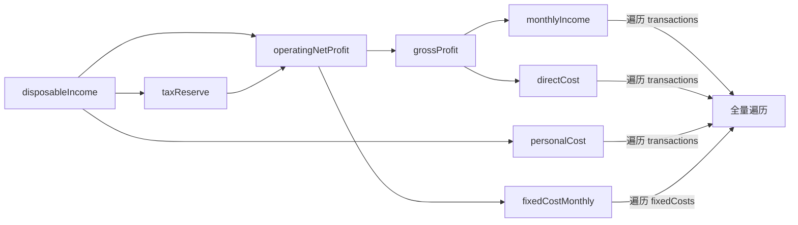

# 性能优化第二批：经营看板 + 统计页 + 刷新收敛

第一批（首页 / 全部账单页 / 项目卡片 / 手势）已完成并构建通过，`dataVersion` 机制已就位。本批处理剩余部分。

## 三个新发现（原文档未覆盖）

### 1. 计算属性是级联的，实际成本远高于"访问次数"

原文档说经营看板有 48 处 `project.xxx` 访问。但这些属性互相调用，单次访问会放大：



读一次 `project.disposableIncome` = **7 次全量遍历**（`operatingNetProfit` 被算两遍，它下面又各带 3 次）。`grossMargin` 一次 = 3 次。所以 48 处访问落到实际是上百次遍历。

### 2. `ProjectEarningView` 是死代码（已确认删除）

`showEarningDashboard` 在 [ProjectDetailView.swift:20](moneyfull_ios/Views/ProjectDetailView.swift) 声明、`:511` 绑定 `fullScreenCover`，但全仓库无一处置为 `true`。搞钱模式 Pro 入口已改为 `ProjectDashboardView`（`:743`）。原计划的 28 处改动直接免除。

### 3. 趋势图的时间区间算错了（附带 bug）

[ProjectDashboardView.swift:319](moneyfull_ios/Views/ProjectDashboardView.swift)：

```swift
let endDate = calendar.date(byAdding: .month, value: 1, to: startDate) ?? date
```

不论 `period` 是月/季/年，结束时间都只加 **1 个月**。所以选"季度"时只统计了每个季度的第一个月，选"年"时只统计了每年 1 月。趋势图数字是错的。改造 `calculateAmountForPeriod` 时顺手修掉。

---

## 步骤

### 步骤 1 · 删除 `ProjectEarningView`

- 删除 [moneyfull_ios/Views/ProjectEarningView.swift](moneyfull_ios/Views/ProjectEarningView.swift)（548 行）
- 清理 [ProjectDetailView.swift](moneyfull_ios/Views/ProjectDetailView.swift) 的 `@State showEarningDashboard`（`:20`）与对应 `.fullScreenCover`（`:511-517`）
- 从 Xcode 工程移除文件引用，确认构建通过

先做这步，后续步骤的改动面立刻缩小。

### 步骤 2 · 统计页：修数字漏更新

[AnalyticsView.swift:385-386](moneyfull_ios/Views/AnalyticsView.swift) 现在的双信号有盲区（`recentTransactions` 有 `fetchLimit=50`，超过 50 条后 count 恒定；`monthlyExpense` 只覆盖本月支出）。

改为可见性感知的 `dataVersion` 驱动，替换这两行：

```swift
@State private var loadedVersion: Int = -1
@State private var isVisible = false

.onAppear { isVisible = true; reloadIfStale() }
.onDisappear { isVisible = false }
.onChange(of: store.dataVersion) { if isVisible { reloadIfStale() } }
// reloadIfStale: guard loadedVersion != store.dataVersion, 然后 reload + 记录版本
```

这样：在统计页时数据变了立即刷新；不在统计页时不做无谓计算，切回来因版本号不等而补算一次。用版本号比对天然幂等，不会重复算。

`AnalyticsView` 一旦被访问过就常驻在 `TabView` 里，现在的 `.onChange(of: store.monthlyExpense)` 会在用户**在首页记账那一刻**触发一次完整重算 —— 加了 `isVisible` 判断后这部分白算也一并消除。

### 步骤 3 · 统计页：优化重算算法

三个热点都在 `updateFilteredData()` / `computeTrendData()`（[AnalyticsView.swift:81-265](moneyfull_ios/Views/AnalyticsView.swift)）：

1. **`Calendar.current` 写在循环内**（`:164`）：`Set(allTransactions.map { Calendar.current.startOfDay(for: $0.date) })` —— 5000 条就构造 5000 次日历实例。提到闭包外复用。

2. **用 `calendar.isDate(_:equalTo:toGranularity:)` 做区间过滤**（`:95` 月、`:97` 年）：这个 API 每次调用都做日历分解，很慢。改成预先算出区间的 `start` / `end` 两个 `Date`，然后用 `$0.date >= start && $0.date < end` 简单比较。

3. **趋势图是 O(N × 桶数)**（`:214-265`）：现在每个时间桶都把 `allTransactions` 完整 filter 一遍，年视图是 12 × N。改成先算好桶边界，再**一次遍历** `allTransactions`，按日期直接投进对应桶，降到 O(N)。`_allTxDaysCount`（`:164`）可以在同一次遍历里顺带累计，省掉独立的一趟。

### 步骤 4 · 新建 `DashboardProjectStats`

在 [Services/ProjectStatsCalculator.swift](moneyfull_ios/Services/ProjectStatsCalculator.swift) 增加第三套 stats（现有 `LifestyleProjectStats` / `EarningProjectStats` 只服务 AI 复盘，字段对不上 V7 经营看板）：

```swift
struct DashboardProjectStats {
    // 现金流
    let availableCash, monthlyNetCashFlow, operatingCashFlow, personalCashFlow, upcomingFixedCosts: Double
    // 收入
    let monthlyIncome, totalReceivable, overdueReceivable, overdueRatio: Double
    let incomeByCategory: [(categoryName: String, amount: Double, percentage: Double)]
    // 成本
    let directCost, fixedCostMonthly, personalCost: Double
    let costPercentage: (direct: Double, fixed: Double, personal: Double)
    // 利润
    let grossProfit, grossMargin, operatingNetProfit, taxReserve, disposableIncome: Double
    // 基础
    let totalSpent, totalIncome: Double
    // 趋势（按 selectedPeriod / selectedDimension 分桶后的结果）
    let trend: [(date: Date, amount: Double)]
    let stackedCost: [(date: Date, type: String, amount: Double)]
    let profitTrend: [...]
}
```

`calculateDashboardStats(project:period:dimension:)` 内部**只做 3 次遍历**：`transactions` 一次（累加出 monthlyIncome / directCost / personalCost / totalSpent / totalIncome / operatingCashFlow / personalCashFlow / incomeByCategory / 三组趋势分桶）、`fixedCosts` 一次、`receivables` 一次。其余全是纯算术派生，级联成本归零。

注意：现有 `calculateLifestyleStats` / `calculateEarningStats` 内部同样在反复调 `project` 的计算属性，效率不高，但它们只在 AI 复盘时触发（一次性用户操作），**本批不动**。

### 步骤 5 · 改造 `ProjectDashboardView`

[ProjectDashboardView.swift](moneyfull_ios/Views/ProjectDashboardView.swift) 主 View 加 `@State private var stats: DashboardProjectStats?`，由 `.task(id: store.dataVersion)` + `.onChange(of: selectedPeriod)` + `.onChange(of: selectedDimension)` 驱动重算（页面是 NavigationLink push 出来的，非常驻，进页面算一次即可）。

改造点：

- 主 View：`cashFlowOverviewCard`（`:65-81`）、三个趋势 computed（`:279` `trendData`、`:340` `stackedCostData`、`:380` `profitTrendData`）改为读 `stats`
- `CashFlowDimensionCard`（`:472`）：含 `GeometryReader` 内的 `operatingCashFlow`（`:550`）
- `IncomeDimensionCard`（`:603`）：`Chart(project.incomeByCategory.prefix(5))`（`:684`）直接把计算属性当数据源，改为传预算好的数组
- `CostDimensionCard`（`:750`）：`costPercentage`（`:966-971`）一处就是 6 次遍历
- `ProfitDimensionCard`（`:986`）：`GeometryReader` 内 5 个属性（`:1018-1022`）

四个子卡片的初始化签名从 `(project: Project)` 改为 `(stats: DashboardProjectStats)`（或同时传 project 供非统计字段用，如 `project.fixedCosts` 的 ForEach 列表）。

顺带修步骤 0 提到的 `endDate` 区间 bug。

### 步骤 6 · `ProjectDetailView` 经营看板入口卡

[ProjectDetailView.swift:764-789](moneyfull_ios/Views/ProjectDetailView.swift) 的 `earningEntryCard` 读了 `availableCash` ×2、`monthlyNetCashFlow` ×2、`grossMargin` ×2、`disposableIncome` ×1、`totalReceivable` ×2 —— 按级联展开约 **25 次全量遍历**，而 `ProjectDetailView` 是用户会反复滚动的常驻页面。

复用步骤 4 的 `DashboardProjectStats`，加进该页已有的缓存体系（`_totalSpent` / `_totalIncome` 那一套，见 `:29-31`），由现有的 `updateCacheData()` 一并产出。

同时把 `:539` 的 `.onChange(of: project.transactions?.count)`（每次 body 求值都会 fault 整个关系）和 `:547` 的 `.onReceive(NSManagedObjectContextDidSave)` 统一换成 `.task(id: store.dataVersion)`。

### 步骤 7 · `ProjectLifestyleView` 轻量优化

[ProjectLifestyleView.swift](moneyfull_ios/Views/ProjectLifestyleView.swift) 已经手工把 `totalSpent` / `totalDays` 存进了 local（`:17-18`），情况比预期好。剩一处：`ForEach(budgetItems)`（`:230`）内每行调 `categorySpent()`（`:89`）都重扫一遍 `transactions`，改成先聚合成 `[分类名: 金额]` 字典再查表。

### 步骤 8 · 刷新收敛

[AppStore.swift](moneyfull_ios/Models/AppStore.swift) 三件事：

**8a. `@Published` 加相等性判断。** 现在 `refresh()` 无条件给 8 个属性赋值，即使数据没变也会触发 `objectWillChange` → 全屏重绘。`Double` 标量直接判断即可；数组元素是 SwiftData `@Model`（class），同一 context refetch 返回同一实例，`==` 理论上能命中，但**需实测验证**，若不命中就退化为只对标量做判断。

**8b. 拆分 `refresh()`。** 拆成 `refreshProjects()` / `refreshTransactions()` / `refreshCategories()` / `refreshNotices()`，各写方法只调需要的域；保留全量 `refresh()` 供启动与 CloudKit 变更使用。需逐个核对现有写方法该调哪些域，**这是本批回归风险最集中的地方**。

**8c. 收窄 `dataVersion` 的触发面。** `dataVersion` 是各页面统计缓存的失效信号，但分类改名、消息已读这类变更不影响任何金额统计。改为只在 `Transaction` / `Project` / `BudgetItem` / `TimeEntry` / `Receivable` / `FixedCost` 变更时自增。分类和消息中心继续走各自的 `@Published`。

**8d.** 复查 `fetchCategories()` → `repairCloudKitCategoriesIfNeeded()` → `save()`（`:190-239`）的潜在回环：`save()` 会触发 `objectsDidChange` → `triggerDebouncedRefresh()` → 又进 `fetchCategories()`。

### 步骤 9 · 验证

沿用第一批的 5000 条测试数据集。

性能验收：
- 经营看板打开耗时、切换维度/周期的响应，对比改造前
- `ProjectDetailView` 滚动帧率（步骤 6 的收益）
- 统计页打开、切换周/月/年的响应（步骤 3 的收益）
- 在首页记一笔账，确认统计页**不再**被触发重算（步骤 2 的收益，用 Instruments 或临时日志确认）

功能回归（步骤 2 和 8 都改了刷新逻辑，必须逐项手测）：
- 记一笔**收入** → 统计页数字更新（这是原来的 bug 场景）
- 补记一笔**往月**的账 → 统计页更新
- 只改分类/备注不改金额 → 统计页更新
- 删除一笔往月账单 → 统计页更新
- 人在统计页时数据变化 → 立即刷新
- 经营看板四个维度数字与改造前逐项对拍
- 季度/年度趋势图数字变化（步骤 5 修了 bug，数字**应该**和以前不同，需人工确认新值正确）
- 分类增删改后，分类选择器与各页面正常
- 消息中心已读状态、项目归档/置顶/排序

---

## 风险

- **步骤 8b 拆分 `refresh()`** 是本批最大风险点。建议单独一个提交，做完先只测"各种写操作后各页面是否都正确更新"，通过后再继续。
- **步骤 5 的子卡片签名变更**涉及 4 个 struct，改到一半无法编译，建议一次改完再构建。
- **步骤 3 的趋势分桶重写**要保证桶边界与原来完全一致，否则图表会平移。建议改造前先用现有实现打印一组数据留底对拍。
- 步骤 5 修 `endDate` bug 后季度/年趋势数字会变，这是预期内的修正，但要在发版说明里提一句，避免用户以为是新 bug。

## 本批不做

`Transaction.date` 加 `#Index`（涉及 SwiftData 迁移，需在真实库副本单独验证）、`@Observable` 迁移、`ProjectStatsCalculator` 中 AI 复盘那两套 stats 的内部优化、`Color.hexCache` 线程安全、《账号体系与数据云化》相关一切。