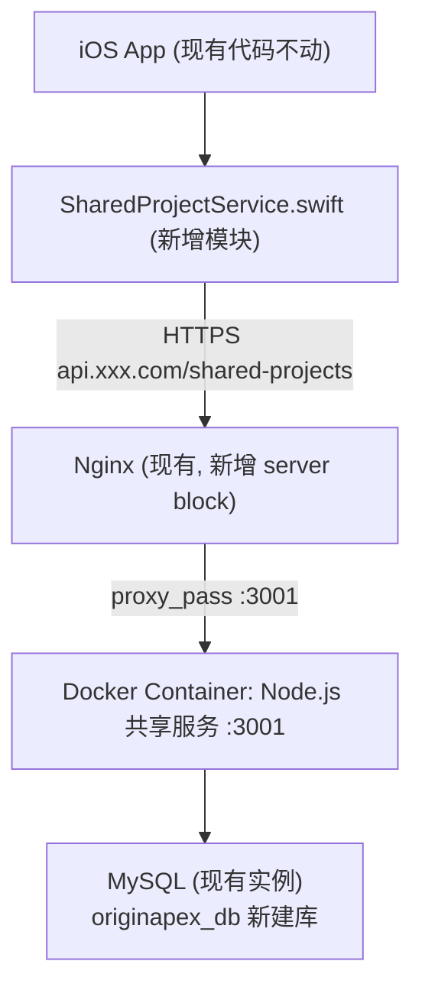

# 极简共享记账服务 — 技术落地计划

## 整体架构图



## 阶段划分

### Phase 1 — 服务端（约 3-5 天）

**1. 本地新建 Node.js 项目**

项目放在独立目录，与现有 iOS 项目分开：

```
originapex-shared-service/
├── src/
│   ├── app.js              # Express 入口
│   ├── db.js               # MySQL 连接池 (连接 originapex_db)
│   ├── routes/
│   │   └── sharedProjects.js   # 全部 6 个接口
│   └── utils/
│       ├── inviteCode.js   # 邀请码生成
│       └── rateLimit.js    # IP 限流
├── sql/
│   └── init.sql            # 建表语句 (3张 mf_shared_* 表)
├── Dockerfile
├── docker-compose.yml
└── .env.example            # 数据库连接配置模板
```

**2. Docker 化**

`Dockerfile` 用 `node:20-alpine`，暴露 `3001` 端口。
`docker-compose.yml` 只包含这一个服务，MySQL 连接宿主机已有实例：

```yaml
# docker-compose.yml 核心配置
services:
  shared-service:
    build: .
    ports:
      - "3001:3001"
    extra_hosts:
      - "host.docker.internal:host-gateway"  # Linux 服务器连宿主机 MySQL 的关键配置
    env_file: .env
    restart: unless-stopped
```

**3. 服务器上操作（不需要提前提供服务器信息，到时候 SSH 进去操作）**

```bash
# 登录服务器后：
# a. 在 MySQL 里建库
mysql -u root -p -e "CREATE DATABASE originapex_db CHARACTER SET utf8mb4;"

# b. 执行建表 SQL（3 张表 + future_user_id 字段）
mysql -u root -p originapex_db < sql/init.sql

# c. 启动 Docker 容器
docker-compose up -d
```

**4. Nginx 新增 server block**

在现有 Nginx 配置目录新增一个文件（不修改已有配置）：

```nginx
# /etc/nginx/conf.d/shared-api.conf  (新增文件)
server {
    listen 443 ssl;
    server_name api.moneyfull.com;   # 域名可按实际情况定

    location /shared-projects {
        proxy_pass http://127.0.0.1:3001;
        proxy_set_header Host $host;
        proxy_set_header X-Real-IP $remote_addr;
    }
}
```

用 `certbot` 申请该子域名的 SSL 证书（免费）。

---

### Phase 2 — iOS 客户端（约 5-7 天）

**新增文件清单（现有文件零改动）：**

- `Services/SharedProjectService.swift` — 所有 API 调用封装，基于 `URLSession`
- `Models/SharedTransaction.swift` — 纯 `Codable struct`，不用 SwiftData
- `Views/SharedProjectListView.swift` — 在项目列表页追加"共享账本"区块
- `Views/ShareProjectView.swift` — 创建共享项目 + 展示邀请码（含分享 Sheet）
- `Views/JoinProjectView.swift` — 6 位邀请码输入 + 设置昵称
- `Views/SharedProjectDetailView.swift` — 共享账本详情 + 写入流水

**本地持久化**（不用 SwiftData，用 `UserDefaults` 存已加入的项目列表 + 最后同步时间）

**增量同步时机**：
- App 进入前台（`scenePhase == .active`）触发一次全量拉取
- 写入流水后立即推送
- 前台时每 30s 轮询

---

### Phase 3 — 测试与上线（约 2-3 天）

- 用 Postman 测 6 个接口（含幂等写入、增量拉取、逻辑删除）
- 两台真机模拟 A/B 用户：A 创建账本 → B 输入邀请码加入 → 互相记账 → 验证同步
- TestFlight 内测发布

---

## 关键技术决策说明

- **为何用 Docker**：不清楚现有服务器环境，Docker 完全隔离，不影响其他项目，端口冲突概率最低
- **为何共用已有 MySQL**：不需要额外安装，只建一个新 database `originapex_db`，资源占用极低
- **iOS 为何不改 SwiftData**：单人模式完全保留，共享模块是独立功能，两套数据流不交叉，风险最低
- **`future_user_id` 字段**：建表时预留，账号体系上线后通过 `device_id` 关联回填，无需 `ALTER TABLE`
