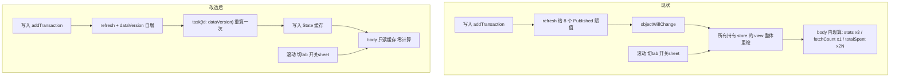

# 钱小满滚动性能优化 · 第一批

## 范围

依据 [项目进度文档/滚动卡顿性能优化方案.md](项目进度文档/滚动卡顿性能优化方案.md)，本批执行：

- 阶段 0 全部（基线测量）
- 阶段 1 的首页 / 全部账单页 / 项目卡片部分（**不含**经营看板）
- 阶段 2 全部（手势）
- 阶段 3 中的 `dataVersion`（前置，见下）

**不做**：经营看板 `ProjectDashboardView` / `ProjectEarningView` 改造、`refresh()` 拆分、`@Observable` 迁移、`#Index`、《账号体系与数据云化》相关一切。

## 两处对原文档的偏离

**1. `dataVersion` 从阶段 3 前置到第一步。** 阶段 1 要把统计值从 computed property 改成 `@State` 缓存，缓存必须有可靠的失效信号，否则就是在赌"哪个 `@Published` 变化会顺带触发重绘"。先建立统一信号，后面每个页面的缓存都挂在它上面。这是纯增量改动，不影响现有行为。

**2. 手势方案改为只动 `SwipeActionView` 内部。** 三处调用点（[DashboardView.swift:257](moneyfull_ios/Views/DashboardView.swift)、[AllTransactionsView.swift:368](moneyfull_ios/Views/AllTransactionsView.swift)、[ProjectDetailView.swift:431](moneyfull_ios/Views/ProjectDetailView.swift)）的代码和视觉完全不变。

## 数据流：改造前后



关键：实时性由 `dataVersion` 保证（写入即自增即重算），与现在完全一致；滚动不再触发任何计算。

---

## 执行步骤

### 步骤 0 · 基线（必须最先做）

在 [moneyfull_ios/Views/ProfileView.swift](moneyfull_ios/Views/ProfileView.swift) 底部加一个 `#if DEBUG` 区块，提供"生成 5000 条测试账单"和"清空测试账单"两个按钮（用 `importBatchID` 标记，便于一键清除）。

然后记录基线，三项都要留截图或数字：

- Instruments SwiftUI 模板 → View Body：首页 / 全部账单页各自的 body 调用次数与总耗时
- Instruments Time Profiler：主线程栈中 `fetch` / `filter` / `reduce` 占比
- 同一台真机，Debug 与 Release 各跑一遍滚动，对比帧率（用于量化 DEBUG `print` 的影响）

### 步骤 1 · `AppStore` 引入 `dataVersion`

在 [moneyfull_ios/Models/AppStore.swift](moneyfull_ios/Models/AppStore.swift) 增加：

```swift
/// 统一数据变更信号：任何写操作后自增，供各 View 作为缓存失效依据
@Published private(set) var dataVersion: Int = 0
```

在 `refresh()` 末尾自增一次即可 —— 现有所有写方法（`addTransaction` / `updateTransaction` / `deleteTransaction` / `addProject` / ...）都已经调用 `refresh()`，以及 CloudKit 变更走的 `triggerDebouncedRefresh()` 也会落到 `refresh()`，所以一处改动即全覆盖。

### 步骤 2 · `stats(for:)` 用 `#Predicate` 下推

现状 [AppStore.swift:273-281](moneyfull_ios/Models/AppStore.swift) 是全表 fetch + 全量排序后再内存 filter，导致"本月"的成本等同"累计"：

```swift
let descriptor = FetchDescriptor<Transaction>(sortBy: [SortDescriptor(\.date, order: .reverse)])
let allTxs = (try? modelContext.fetch(descriptor)) ?? []
let txs = period == .all ? allTxs : allTxs.filter { $0.date >= startDate }
```

改为把时间范围写进 `#Predicate`，并去掉不需要的 `sortBy`（求和不依赖顺序）。同时一次遍历同时累加收入与支出，替代现在的两次 `filter` + 两次 `reduce`。

### 步骤 3 · 项目汇总表 `ProjectSummary`

根因在 [Models.swift:111-124](moneyfull_ios/Models/Models.swift)：`budgetProgress` 内部又调了一次 `totalSpent`，每张卡片遍历两遍。

在 `AppStore` 增加：

```swift
struct ProjectSummary { let totalSpent: Double; let totalIncome: Double; let budgetProgress: Double }
@Published private(set) var projectSummaries: [UUID: ProjectSummary] = [:]
```

在 `fetchProjects()` 里一次遍历产出全部项目的汇总。改造两个卡片消费方：

- [DashboardView.swift:445-510](moneyfull_ios/Views/DashboardView.swift) `ProjectCard`
- [ProjectsView.swift:161-293](moneyfull_ios/Views/ProjectsView.swift) `ProjectDetailCard`

保留 `Project` 上的计算属性不动（AI 复盘等非渲染路径仍在用），只是渲染路径不再走它们。

### 步骤 4 · `DashboardView` 缓存化

[DashboardView.swift](moneyfull_ios/Views/DashboardView.swift) 三处改动：

1. `currentStats`（`:40-48`）改为 `@State private var _stats` + `.task(id: store.dataVersion)` 重算。现在它在 body 里被访问三次（`:92` / `:100` / `:101`），改完是零次计算。同时 `selectedPeriod` 变化也要触发重算，用 `.task(id: ...)` 组合 key 或加一个 `.onChange`。
2. 删除 `.onChange(of: store.fetchTotalTransactionCount())`（`:315-317`）—— 这个 `of:` 表达式每次 body 求值都会打一次数据库。改为挂在 `store.dataVersion` 上。
3. 横向项目列表（`:198-212`）`HStack` → `LazyHStack`。

照 [AnalyticsView.swift:51-78](moneyfull_ios/Views/AnalyticsView.swift) 已有的 `_xxx` 缓存 + 代理属性 + `updateXxx()` 范式写，保持代码风格一致。

### 步骤 5 · `AllTransactionsView` 单次计算

[AllTransactionsView.swift](moneyfull_ios/Views/AllTransactionsView.swift) 现在一次 body 打 7 次全表 fetch。改造：

- `filteredTransactions`（`:45-109`）只算一次存 `@State`
- `groupedTransactions`（`:112-130`）、`totalExpense`（`:139`）、`totalIncome`（`:143`）、`allCategories`（`:133`）全部从这一份结果派生，不再各自 fetch
- `statsCard` 里 `let net = totalIncome - totalExpense`（`:317`）自然跟着解决
- 重算时机：`.task(id: store.dataVersion)` + 各筛选条件变化
- **删掉热路径上的 DEBUG `print`**：`:48-57`、`:123-128`（循环打印）、[AppStore.swift:179-181](moneyfull_ios/Models/AppStore.swift)

### 步骤 6 · `SwipeActionView` 手势修复

只改 [moneyfull_ios/Components/CommonViews.swift:408-503](moneyfull_ios/Components/CommonViews.swift) 内部，把 `.gesture(DragGesture(minimumDistance: 20))`（`:466-487`）换成 UIKit 桥接的 `UIPanGestureRecognizer`。

核心是 delegate 里这一句 —— 垂直方向直接不启动，触摸完整留给 ScrollView：

```swift
func gestureRecognizerShouldBegin(_ g: UIGestureRecognizer) -> Bool {
    guard let pan = g as? UIPanGestureRecognizer else { return false }
    let v = pan.velocity(in: pan.view)
    return abs(v.x) > abs(v.y)
}
```

挂载方式：用一个 `UIViewRepresentable` 放在 `.background()`，其 UIView 重写 `point(inside:)` 返回 `false`（自身不拦截任何触摸），在 `didMoveToWindow` 时把 recognizer 装到 `superview` 上。同时设 `cancelsTouchesInView = false`，保证行内的 tap（查看详情）不受影响。

> `UIGestureRecognizerRepresentable` 是 iOS 18+ API，当前部署目标 17.6 用不了，所以走 `UIViewRepresentable`。
>
> **备选方案**（若 `superview` 挂载在某些嵌套层级下不稳定）：改用嵌套 `ScrollView(.horizontal)` + `.scrollTargetBehavior(.viewAligned)` 实现划出，UIKit 的 scrollView 间方向消歧是系统原生行为，天然不会和垂直滚动打架，且都是 iOS 17 API。代价是划出手感会带一点 scroll 的橡皮筋，与现在的 spring 动画略有差异。

### 步骤 7 · `ProfileView` 收尾

[ProfileView.swift:28](moneyfull_ios/Views/ProfileView.swift) 的 `totalTxCount` 同样是 body 内查库，改为缓存 + `dataVersion` 驱动。

### 步骤 8 · 验证

用步骤 0 的 5000 条数据集，重跑基线三项对比。验收标准：

- 首页单次 body 内 `fetch` 调用数从 4+ 降到 0
- 全部账单页从 7 次降到 1 次（且只在 `dataVersion` 或筛选条件变化时发生）
- 5000 条数据下滚动稳定 60fps
- 连续快速滑动 30 次，无一次"第一下没反应"
- **功能回归**：记一笔 / 编辑 / 删除 / 切换统计维度 / 切筛选器后，各页数字立即正确更新（这是缓存化最需要盯的回归点）

---

## 风险点

- **缓存失效遗漏**是本批唯一的实质风险。统一挂在 `dataVersion` 上而非各自接线，就是为了把这个风险收敛到一个点。步骤 8 的功能回归必须逐项手测。
- `Color.hexCache` 的线程安全问题（P2-1）本批不处理，但如果步骤 6 引入了任何后台线程取色，需要提前处理。
- 经营看板两个页面本批不动，它们进页面时依然会慢 —— 这是已知且被接受的，留到第二批。

## 第二批预告（本次不做）

经营看板 `ProjectDashboardView` 48 处 + `ProjectEarningView` 18 处收敛到新的 `DashboardProjectStats`（注意现有 [ProjectStatsCalculator.swift](moneyfull_ios/Services/ProjectStatsCalculator.swift) 只覆盖 AI 复盘用的生活/搞钱两套指标，V7 经营看板那套需要新增）、`refresh()` 拆分、`@Published` 相等性判断、`Transaction.date` 加 `#Index`（涉及 SwiftData 迁移，需在真实库副本上单独验证）。