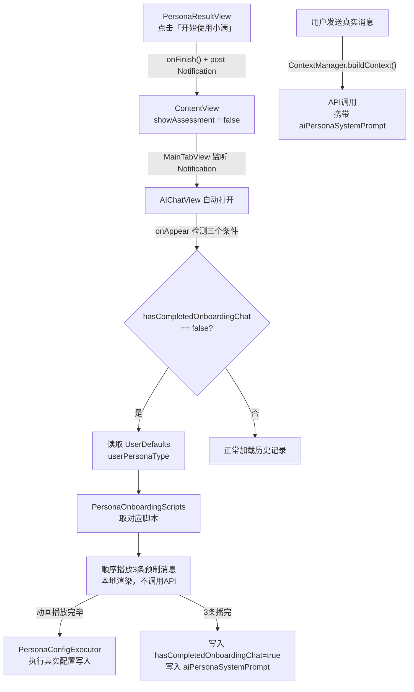

# 首次画像引导 AI 聊天 · 开发实施计划

## 数据流总览



## 一、新增文件（2个）

### `PersonaOnboardingScripts.swift`

定义预制消息的所有数据结构和5套文案内容：

```swift
enum OnboardingCTAAction {
    case showBackTapSetup       // B/E画像：无痛记账
    case requestNotification    // C画像：通知权限
}

struct OnboardingMessageConfig {
    let text: String
    let animationItems: [String]?   // 非nil时显示配置动画
    let imageName: String?          // Assets.xcassets 图片名
    let ctaAction: OnboardingCTAAction?
    let delayBeforeShow: TimeInterval
}

enum PersonaOnboardingScript {
    static func messages(for persona: PersonaType) -> [OnboardingMessageConfig]
    // 包含 A/B/C/D/E 五套静态内容
}
```

### `PersonaConfigExecutor.swift`

配置动画完成后执行真实 App 状态写入：

```swift
struct PersonaConfigExecutor {
    static func execute(for persona: PersonaType, store: AppStore)
    // A: 初始化自由职业分类 + 开启 ROI Dashboard
    // B: voiceEntryEnabled=true, screenshotRecognitionEnabled=true
    // C: 创建默认生活预算 + 超支提醒阈值0.8
    // D: analyticsEnabled=true, monthlyAIReportEnabled=true
    // E: capybaraHealthEnabled=true + 每日21:00提醒
}
```

## 二、修改现有文件（6个）

### 1. `Models/Models.swift` — ChatHistory 模型

添加 `isPrescripted` 字段，SwiftData 默认值自动兼容旧数据：

```swift
@Model final class ChatHistory {
    // ... 现有字段 ...
    var isPrescripted: Bool = false   // 新增
}
```

### 2. `AIChatView.swift` — ChatMessage 结构体

扩展现有 `ChatMessage`（[`moneyfull_ios/Views/AIChatView.swift:1108`](moneyfull_ios/Views/AIChatView.swift)）：

```swift
struct ChatMessage: Identifiable {
    // ... 现有字段 ...
    var isPrescripted: Bool = false          // 不计入 AI 配额
    var animationItems: [String]? = nil     // 配置动画列表
    var onboardingImageName: String? = nil  // 效果图
    var ctaAction: OnboardingCTAAction? = nil
}
```

### 3. `AIChatView.swift` — onAppear + 消息播放器

在 `onAppear`（[`moneyfull_ios/Views/AIChatView.swift:308`](moneyfull_ios/Views/AIChatView.swift)）注入检测逻辑：

```swift
.onAppear {
    loadChatHistory()
    // 首次画像引导检测
    let assessed = UserDefaults.standard.bool(forKey: "hasCompletedAssessment")
    let chatDone = UserDefaults.standard.bool(forKey: "hasCompletedOnboardingChat")
    if assessed && !chatDone && messages.isEmpty {
        showGuide = false   // 关闭旧的通用引导
        playOnboardingMessages()
    }
}
```

新增 `playOnboardingMessages()` 方法：
- 读取 `userPersonaType` 获取 `PersonaType`
- 取 `PersonaOnboardingScript.messages(for: persona)`
- 按 `delayBeforeShow` 逐条 append 到 `messages`
- 第一条消息含 `animationItems` 时，动画播完后调用 `PersonaConfigExecutor.execute()`
- C 画像第三条消息后 1s 触发通知权限弹窗
- 全部播完写入 `hasCompletedOnboardingChat = true` + `aiPersonaSystemPrompt`

### 4. `AIChatView.swift` — ChatBubble 渲染扩展

在 `ChatBubble` 中添加两个新渲染分支（[`moneyfull_ios/Views/AIChatView.swift:1173`](moneyfull_ios/Views/AIChatView.swift)）：

- `animationItems != nil` → 渲染 `OnboardingAnimationView`（0.3s/项的勾选动画，内嵌在气泡底部）
- `onboardingImageName != nil` → 渲染圆角缩略图，点击 `fullScreenCover` 查看全图
- `ctaAction != nil` → 渲染 CTA 按钮，点击触发 `showBackTapTutorial` 或通知权限

### 5. `Services/ContextManager.swift` — 注入画像 System Prompt

在 `buildContext()` 开头（[`moneyfull_ios/Services/ContextManager.swift:38`](moneyfull_ios/Services/ContextManager.swift)）加一段：

```swift
// 注入画像系统 Prompt
if let systemPrompt = UserDefaults.standard.string(forKey: "aiPersonaSystemPrompt") {
    context = systemPrompt + "\n\n" + context
}
```

同时修改 `fetchChatHistory` 时过滤掉预制消息，避免把 Onboarding 内容送进 API：

```swift
// 只取真实消息（非预制）用于构建 recentChats 上下文
let recentChats = allChats.filter { !$0.isPrescripted }.prefix(5)
```

### 6. `ContentView.swift` — 测评完成后跳转 AI 聊天

在 `PersonaResultView` 的 `onFinish` 回调（[`moneyfull_ios/ContentView.swift:75`](moneyfull_ios/ContentView.swift)）增加通知：

```swift
} {  // onFinish
    showAssessment = false
    assessmentStep = .quiz
    // 新增：触发 AI 聊天 Onboarding 跳转
    DispatchQueue.main.asyncAfter(deadline: .now() + 0.4) {
        NotificationCenter.default.post(name: .navigateToOnboardingChat, object: nil)
    }
}
```

在 `MainTabView` 中监听此 Notification，自动打开 `AIChatView`（与现有 `deepLinkReceived` 处理方式一致）。

## 三、图片资源

5 张效果图需添加至 `Assets.xcassets`，命名：

| 画像 | Asset 名 | 尺寸 |
|---|---|---|
| A | `onboarding_result_earner` | 600×400 @2x |
| B | `onboarding_result_efficiency` | 600×400 @2x |
| C | `onboarding_result_moonlight` | 600×400 @2x |
| D | `onboarding_result_datadriven` | 600×400 @2x |
| E | `onboarding_result_steady` | 600×800 @2x |

图片由产品提供，开发预留占位 asset。

## 四、关键 UserDefaults Keys（新增）

| Key | 类型 | 说明 |
|---|---|---|
| `hasCompletedOnboardingChat` | Bool | 防重触发 |
| `aiPersonaSystemPrompt` | String | AI 对话系统 Prompt |

## 五、开发顺序

按依赖顺序，前项完成后开始后项：

1. `Models.swift` ChatHistory 加字段（5min）
2. `PersonaOnboardingScripts.swift` 定义数据结构 + 填入5套文案（1-2h）
3. `ChatMessage` 扩展新字段（10min）
4. `ChatBubble` 新增渲染分支 + `OnboardingAnimationView`（1.5h）
5. `PersonaConfigExecutor.swift`（30min）
6. `AIChatView.onAppear` 检测 + `playOnboardingMessages()`（1h）
7. `ContextManager` 注入系统 Prompt + 过滤预制消息（20min）
8. `ContentView` 跳转 + `MainTabView` 监听（20min）
9. 联调（1h）

**总估时：约 6-7 小时**
