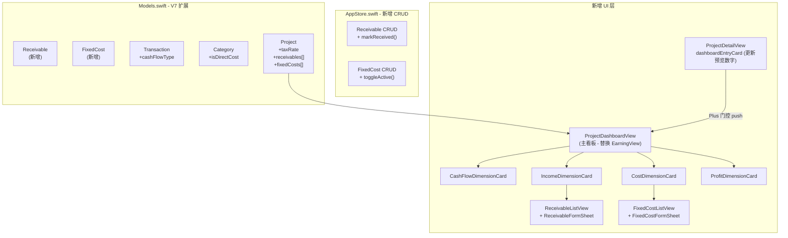

# 经营看板完整版开发计划

## 核心架构决策

- **替换而非扩展**：新 `ProjectDashboardView` 完全替代现有 [`ProjectEarningView.swift`](moneyfull_ios/Views/ProjectEarningView.swift)，后者弃用
- **整体 Plus 门控**：入口在 [`ProjectDetailView.swift`](moneyfull_ios/Views/ProjectDetailView.swift) 的 `dashboardEntryCard` 处统一拦截，`ProjectDashboardView` 内部不再做任何 Plus 判断
- **SwiftData Migration V7**：新增 2 个模型 + 扩展 3 个现有模型需要 migration

## 数据流总览



## Phase 1 — 数据模型层（[`Models/Models.swift`](moneyfull_ios/Models/Models.swift) + [`Models/AppStore.swift`](moneyfull_ios/Models/AppStore.swift)）

**新增 `@Model` 类（V7 Migration）**

- `Receivable`：`clientName`, `projectName`, `amount`, `expectedDate?`, `status`（`"pending"|"overdue"|"received"`）, `receivedDate?`, `note`, `createdAt`, `→ project?`
- `FixedCost`：`name`, `amount`, `frequency`（`"monthly"|"quarterly"|"yearly"`）, `category`, `nextDueDate?`, `isActive`, `createdAt`, `→ project?`

**扩展现有模型**

- `Transaction`：新增 `var cashFlowType: String = "operating"`
- `Category`（注意：PRD 里写 `BudgetCategory`，代码实际类名是 `Category`）：新增 `var isDirectCost: Bool = true`
- `Project`：新增 `var taxRate: Double = 0`，新增两个 `@Relationship(deleteRule: .cascade)` 关联 `receivables: [Receivable]?` 和 `fixedCosts: [FixedCost]?`

**Project 新增计算属性**（直接写在 `Models.swift` Project extension）

- 现金流：`availableCash`, `monthlyNetCashFlow`, `operatingCashFlow`, `personalCashFlow`, `upcomingFixedCosts`
- 收入：`totalReceivable`, `overdueReceivable`, `overdueRatio`, 业务线占比用 `transactions` 按 `categoryName` 聚合
- 成本：`directCost`（按 `category.isDirectCost`），`fixedCostMonthly`（按频率折算月度），`personalCost`
- 利润：`grossProfit`, `grossMargin`, `operatingNetProfit`, `taxReserve`, `disposableIncome`

**AppStore 新增方法**

- `addReceivable(to:clientName:projectName:amount:expectedDate:note:)`
- `updateReceivable(_:...)`, `markReceivable(_:received:)`, `deleteReceivable(_:)`
- `addFixedCost(to:name:amount:frequency:category:nextDueDate:)`
- `updateFixedCost(_:...)`, `toggleFixedCost(_:)`, `deleteFixedCost(_:)`
- 更新 `addTransaction` / `updateTransaction` 签名加入 `cashFlowType` 参数（默认 `"operating"`）

## Phase 2 — 看板主界面（新建文件）

**[`Views/ProjectDashboardView.swift`](moneyfull_ios/Views/ProjectDashboardView.swift)**（替代 `ProjectEarningView`）

- 顶部固定：现金流总览卡（可用资金 + 本月净现金流）
- `Picker` Segmented Control：[现金流 | 收入 | 成本 | 利润]
- `@State var selectedPeriod`：[本月 | 本季 | 本年]，控制所有维度的时间筛选
- 中间动态区域：根据 `selectedDimension` 切换对应 DimensionCard
- 底部趋势图卡：按维度自动切换图表类型（Swift Charts）

**四个维度卡组件**（可放在同文件或独立文件）

- `CashFlowDimensionCard`：累计可用资金、净现金流、经营/个人拆分进度条、未来30天刚性支出
- `IncomeDimensionCard`：已到账收入、应收账款摘要（→ `ReceivableListView`）、业务线环形图
- `CostDimensionCard`：三类成本三格卡、直接成本分类明细、固定成本摘要（→ `FixedCostListView`）
- `ProfitDimensionCard`：利润瀑布（进度条式）、毛利率、可支配收入

**[`Views/ProjectDetailView.swift`](moneyfull_ios/Views/ProjectDetailView.swift)** — `dashboardEntryCard` 更新

- Plus 解锁态：展示 `availableCash`、`monthlyNetCashFlow`、`totalIncome`、`disposableIncome`、`grossMargin`、`totalReceivable`（4 个主指标 + 2 个辅助小字）
- 锁定态：现有 `PlusLockedEntryCard` 文案替换为新说明（现金流 · 收入确认 · 成本拆分 · 利润瀑布）
- 导航目标从 `ProjectEarningView` 改为 `ProjectDashboardView`

## Phase 3 — 管理页面（新建文件）

**[`Views/ReceivableListView.swift`](moneyfull_ios/Views/ReceivableListView.swift)**

- 顶部汇总：待回款总额 + 逾期金额
- 分组列表：进行中 / 逾期（自动按 `expectedDate < Date()` 判断）
- 每行：客户名、金额、预计回款日、[标记到账] [编辑]
- 标记到账 → 调 `store.markReceivable` 并 sheet 跳转到 `AddRecordView` 预填金额/备注

**`ReceivableFormSheet`**（sheet 复用于新增和编辑）：客户名、业务描述、应收金额、预计回款日、备注

**[`Views/FixedCostListView.swift`](moneyfull_ios/Views/FixedCostListView.swift)**

- 月度合计、未来30天到期汇总
- 列表：name、金额、频率、下次扣款日、[停用/启用] [编辑] [删除]

**`FixedCostFormSheet`**：名称、金额、频率（月/季/年）、下次扣款日、分类图标

**[`Views/AddRecordView.swift`](moneyfull_ios/Views/AddRecordView.swift)** — 最小扩展

- 在支出录入时，若当前 project 是搞钱模式，在表单底部追加「更多选项」折叠区
- 折叠区内：`cashFlowType` 切换（经营支出 / 个人支出），由 `category.isDirectCost` 自动预选，用户可覆盖

## Phase 4 — SwiftData V7 Migration

在 [`Models/AppStore.swift`](moneyfull_ios/Models/AppStore.swift) 的 `setupContainer()` 处追加 V7 migration：

```swift
// 新增两个 Model 类型加入 schema
let schema = Schema([Project.self, Transaction.self, Category.self,
                     BudgetItem.self, TimeEntry.self, ChatHistory.self,
                     MemoryRule.self, RecurringBill.self,
                     Receivable.self, FixedCost.self])  // 新增
// Migration plan V6 → V7（字段有默认值，轻量级迁移即可）
let config = ModelConfiguration(schema: schema, isStoredInMemoryOnly: false,
                                 cloudKitDatabase: .automatic)
```

字段均有默认值（`cashFlowType = "operating"`, `isDirectCost = true`, `taxRate = 0`），可直接走轻量级迁移，不需要 `MigrationPlan` 自定义逻辑。
