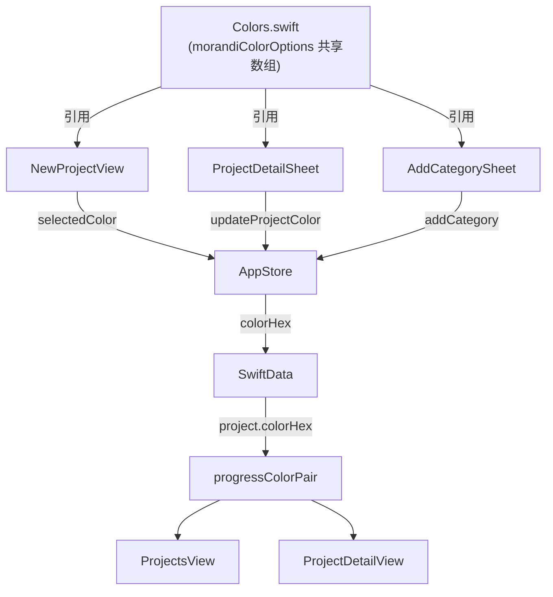

# 莫兰迪配色全局统一

## 问题现状

两套颜色系统完全割裂，互不一致：

- **项目颜色**（`NewProjectView`）：颜色与图标强绑定，无独立选色，`progressColorPair()` 只认7个旧色号
- **分类颜色**（`CategoryManagementView` + `AddRecordView`）：两处各自硬编码一份15色数组（内容还略有不同），都是 Material Design 风格稀释色
- **系统预设分类**（`AppStore.seedDefaultCategories`）：用旧色号（`#A8E6CF`/`#DCDE8D`/`#FDD1B4` 等），与任何色盘都不完全匹配

## 数据流



## 莫兰迪8色色盘

| 主色 hex | 名称 | 深色 variant |
|---|---|---|
| `#A8E0C2` | 薄荷绿 | `#3A7A5E` |
| `#B3D1E6` | 雾霾蓝 | `#2E6A8A` |
| `#F6D7A8` | 杏色 | `#8A5A1E` |
| `#F2B7C6` | 雾粉红 | `#8A3A52` |
| `#D8C6E8` | 薰衣草紫 | `#5A3A7A` |
| `#BFE6EA` | 浅青 | `#2A7A82` |
| `#C8E6C9` | 嫩绿 | `#2E6E30` |
| `#DCCFC4` | 暖米色 | `#7A5A3E` |

## 改动文件

### 1. [`Utils/Colors.swift`](moneyfull_ios/Utils/Colors.swift)

在 `Color.App` 里新增 `Morandi` 命名空间 + 全局共享色盘数组：

```swift
struct Morandi {
    static let mint      = Color(hex: "#A8E0C2")
    static let mistBlue  = Color(hex: "#B3D1E6")
    static let apricot   = Color(hex: "#F6D7A8")
    static let blushPink = Color(hex: "#F2B7C6")
    static let lavender  = Color(hex: "#D8C6E8")
    static let aqua      = Color(hex: "#BFE6EA")
    static let sage      = Color(hex: "#C8E6C9")
    static let warmBeige = Color(hex: "#DCCFC4")
}

static let morandiColorOptions = [
    "#A8E0C2", "#B3D1E6", "#F6D7A8", "#F2B7C6",
    "#D8C6E8", "#BFE6EA", "#C8E6C9", "#DCCFC4",
]
```

### 2. [`Views/NewProjectView.swift`](moneyfull_ios/Views/NewProjectView.swift)

- `iconOptions` 改为只存 `[String]`，选图标只更新 `selectedIcon`，不再联动 `selectedColor`
- `selectedColor` 默认值改为 `"#A8E0C2"`
- 图标选择下方新增"选择颜色"区块，引用 `Color.App.morandiColorOptions`，4列2行圆形色块，选中有描边

### 3. [`Views/ProjectsView.swift`](moneyfull_ios/Views/ProjectsView.swift)

`progressColorPair()` 补充8个莫兰迪 case：

```swift
case "A8E0C2": return ProgressColorPair(start: "#A8E0C2", end: "#3A7A5E")
case "B3D1E6": return ProgressColorPair(start: "#B3D1E6", end: "#2E6A8A")
// ... 其余6个同理
```

### 4. [`Models/AppStore.swift`](moneyfull_ios/Models/AppStore.swift)

新增 `updateProjectColor` 方法：

```swift
func updateProjectColor(_ project: Project, colorHex: String) {
    project.colorHex = colorHex
    save()
    refresh()
}
```

`seedDefaultCategories` 颜色对齐莫兰迪（仅影响新安装用户）：

```swift
("餐饮", "fork.knife",             "#F6D7A8"),
("交通", "car.fill",               "#B3D1E6"),
("购物", "bag.fill",               "#F2B7C6"),
("娱乐", "gamecontroller.fill",    "#D8C6E8"),
("住房", "house.fill",             "#A8E0C2"),
("医疗", "heart.text.square.fill", "#BFE6EA"),
("教育", "graduationcap.fill",     "#C8E6C9"),
("通讯", "phone.fill",             "#B3D1E6"),
("服饰", "tshirt.fill",            "#F2B7C6"),
("日用", "basket.fill",            "#DCCFC4"),
("其他", "ellipsis.circle.fill",   "#DCCFC4"),
```

### 5. [`Views/ProjectDetailView.swift`](moneyfull_ios/Views/ProjectDetailView.swift)

- 顶部导航栏右侧加 `paintpalette` 图标按钮
- 点击弹出轻量 Sheet：标题 + 莫兰迪8色色盘 + 确认按钮
- 调用 `store.updateProjectColor(project, colorHex:)`，主题色实时响应

### 6. [`Views/CategoryManagementView.swift`](moneyfull_ios/Views/CategoryManagementView.swift)

#### 扩充图标库

当前31个图标扩充到约48个，覆盖更多场景，参考 [SF Symbols App](https://developer.apple.com/sf-symbols/)（免费下载，可搜索浏览全部图标）：

- 餐饮：`takeoutbag.and.cup.and.straw.fill`, `birthday.cake.fill`, `wineglass.fill`
- 交通：`tram.fill`, `bicycle`, `bus.fill`, `ferry.fill`
- 家居：`sofa.fill`, `lightbulb.fill`, `washer.fill`, `wrench.and.screwdriver.fill`
- 健康：`cross.fill`, `figure.walk`, `figure.run`, `dumbbell.fill`
- 金融：`banknote.fill`, `dollarsign.circle.fill`, `chart.line.uptrend.xyaxis`
- 社交：`person.2.fill`, `party.popper.fill`, `star.fill`

#### AddCategorySheet → CategoryFormSheet（新增编辑模式）

原 `AddCategorySheet` 扩展为支持新增和编辑两种模式，通过可选参数区分：

```swift
struct CategoryFormSheet: View {
    let iconOptions: [String]
    let colorOptions: [String]
    let editingCategory: Category?        // nil = 新增模式，有值 = 编辑模式
    let onSave: (String, String, String) -> Void

    // 编辑模式时用 editingCategory 初始化 selectedIcon / selectedColor / name
}
```

#### 系统预设 + 自定义分类均支持编辑/删除

- **编辑**：两个 Section 的每行都加 leading swipe action（铅笔图标），点击弹出 `CategoryFormSheet`（编辑模式），调用 `store.updateCategory`
- **删除自定义**：保留现有 trailing swipe delete
- **删除系统预设**：trailing swipe 加删除按钮，点击触发 `confirmDeleteCategory` Alert，确认后调用 `store.deleteCategory`（移除 `isGlobal` 限制）
- footer 文案从"系统预设分类不可删除"更新为"删除系统预设分类后可在此重新添加"

### 7. [`Views/AddRecordView.swift`](moneyfull_ios/Views/AddRecordView.swift) + [`Models/AppStore.swift`](moneyfull_ios/Models/AppStore.swift)

**`AddRecordView`**：本地 `colorOptions` 替换为 `Color.App.morandiColorOptions`，`selectedColor` 默认值改为 `"#A8E0C2"`

**`AppStore` 新增方法：**

```swift
// 更新分类
func updateCategory(_ category: Category, name: String, icon: String, colorHex: String) {
    category.name     = name
    category.icon     = icon
    category.colorHex = colorHex
    save()
    refresh()
}

// 删除分类（移除 isGlobal 限制，改为调用方负责确认）
func deleteCategory(_ category: Category) {
    modelContext.delete(category)
    save()
    refresh()
}
```