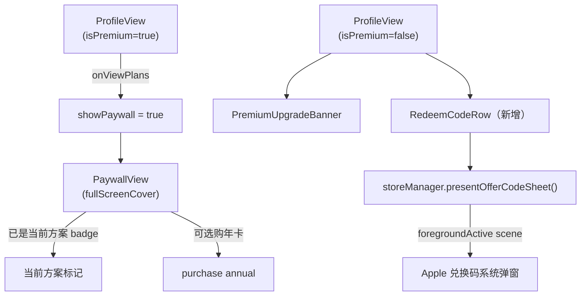

# 订阅页与兑换码修复

## 问题根因分析

### 问题 1：已订阅用户无法进入订阅页
- `ProfileView.swift` 的 premium 区块只有"管理"按钮（跳转 Apple 系统订阅页），没有打开 `PaywallView` 的入口
- `showPaywall = true` 只在非会员分支的 `PremiumUpgradeBanner` 里触发
- `PaywallView` 的 `onChange(of: storeManager.isPremium)` 只在 `isPremium` **发生变化**时才 dismiss，初始加载时不会触发，所以已订阅用户是可以打开 `PaywallView` 的——只是没有入口

### 问题 2：非会员兑换码入口不可见且无法打开
- `RedeemCodeRow` 在 `ProfileView` 里放在 `if storeManager.isPremium` 块内，非会员完全看不到
- 非会员只能从 `PaywallView` 的"兑换会员码"按钮访问，但 `presentOfferCodeSheet()` 使用 `.connectedScenes.first` 查找 scene，在 `fullScreenCover` 弹出层里可能找不到正确的 foreground scene 导致静默失败

---

## 修改方案

### 文件 1：[`moneyfull_ios/Services/StoreManager.swift`](moneyfull_ios/Services/StoreManager.swift)

**a) 新增当前订阅信息属性**

在 `@Published` 属性区增加：
```swift
@Published var currentPlanTitle: String = ""
@Published var currentPlanExpiry: String = ""
```

在 `verifyCurrentEntitlements()` 里解析 `transaction.expirationDate` 和 `transaction.productID`，填充上述属性。

**b) 修复 `presentOfferCodeSheet()`**

改用 `foregroundActive` 过滤，并移到主线程确保 scene 可用：
```swift
func presentOfferCodeSheet() {
    let scene = UIApplication.shared.connectedScenes
        .first(where: { $0.activationState == .foregroundActive }) as? UIWindowScene
    guard let scene else { return }
    Task { @MainActor in
        try? await StoreKit.AppStore.presentOfferCodeRedeemSheet(in: scene)
    }
}
```

---

### 文件 2：[`moneyfull_ios/Views/PaywallView.swift`](moneyfull_ios/Views/PaywallView.swift)

**修改 `PremiumStatusRow`**：增加可选的 `onViewPlans: (() -> Void)?` 回调，在"管理"按钮旁添加"查看方案"按钮（仅当 callback 非 nil 时显示），供已订阅用户打开 PaywallView：

```swift
struct PremiumStatusRow: View {
    let planTitle: String
    let expiryText: String
    let onManage: () -> Void
    var onViewPlans: (() -> Void)? = nil   // 新增
    ...
}
```

**PaywallView 显示当前方案标记**：在 `PaywallPlansSection` 里，当 `storeManager.isPremium` 且某方案与当前订阅匹配时，在卡片上显示"当前方案"角标。

---

### 文件 3：[`moneyfull_ios/Views/ProfileView.swift`](moneyfull_ios/Views/ProfileView.swift)

**a) 已订阅区块：加入"查看方案"入口**

`PremiumStatusRow` 传入 `onViewPlans: { showPaywall = true }` 回调，这样点击"查看方案"按钮即可进入 `PaywallView`。

同时把硬编码的 `planTitle: "年卡"` 换成 `storeManager.currentPlanTitle`，`expiryText` 换成 `storeManager.currentPlanExpiry`。

**b) 非会员区块：补充兑换码入口**

将 `RedeemCodeRow` 移出 `if storeManager.isPremium` 块，非会员时在 `PremiumUpgradeBanner` 下方单独展示：

```
if storeManager.isPremium {
    // PremiumStatusRow + RedeemCodeRow（已含）
} else {
    PremiumUpgradeBanner(...)
    RedeemCodeRow(...)   // ← 移到这里，非会员也能看到
}
```

---

## 数据流变化


