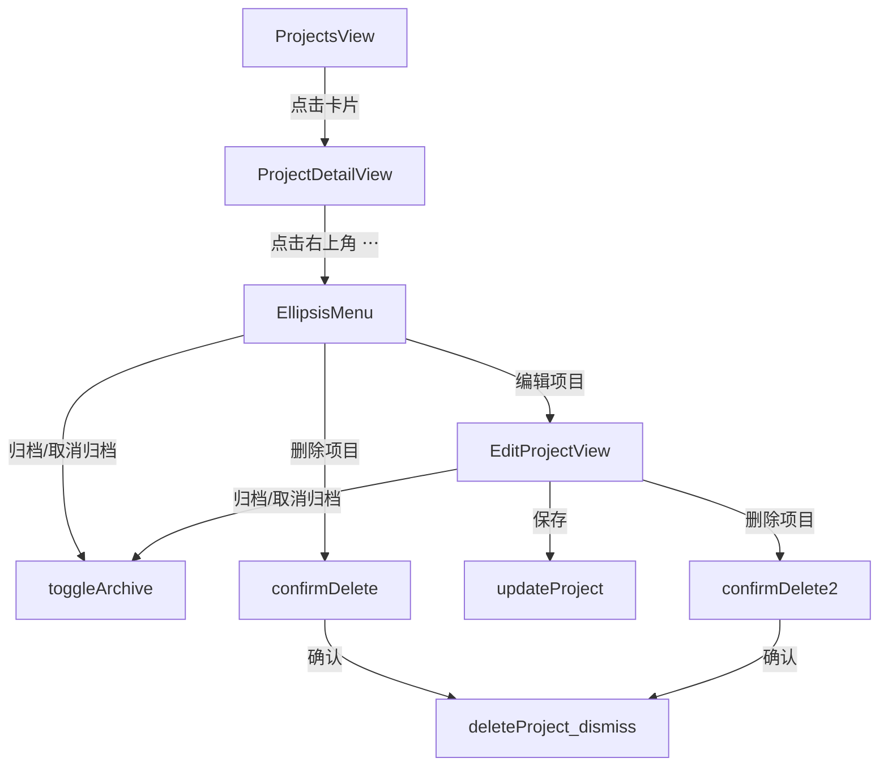

# 项目编辑 & 删除功能

## 目标

在项目 Tab 中为已创建的项目补充完整的管理操作：编辑（名称、描述、预算、图标、颜色）、删除、归档/取消归档。

## 文件改动

### 1. [`AppStore.swift`](moneyfull_ios/Models/AppStore.swift) — 新增 `updateProject` 方法

在已有 `updateProjectColor` 之后补充：

```swift
func updateProject(_ project: Project, name: String, icon: String,
                   colorHex: String, desc: String, budget: Double) {
    project.name = name
    project.icon = icon
    project.colorHex = colorHex
    project.desc = desc
    project.budget = budget
    save()
    refresh()
}
```

### 2. 新建 `EditProjectView.swift`

结构与 `NewProjectView` 完全一致（名称、描述、预算、图标选择、颜色选择、预览），区别：
- 初始化时用 `project` 的现有值预填所有字段
- 确认按钮文案改为"保存"，调用 `store.updateProject()`
- 增加底部"删除项目"危险按钮（红色文字，带 `confirmationDialog` 二次确认），调用 `store.deleteProject()`，删除后 `dismiss` + `popToRoot`
- 增加"归档 / 取消归档"按钮（黄色/绿色），调用 `store.toggleArchive(project:)`

### 3. [`ProjectDetailView.swift`](moneyfull_ios/Views/ProjectDetailView.swift) — 顶部导航栏右上角改为「⋯」Menu 按钮

将原计划的铅笔按钮升级为一个 `Menu`，包含所有项目管理操作，入口统一、界面不拥挤：

```swift
// 右侧 ⋯ 菜单
HStack {
    Spacer()
    Menu {
        Button { showEditProject = true } label: {
            Label("编辑项目", systemImage: "pencil")
        }
        Button { store.toggleArchive(project: project) } label: {
            Label(project.isArchived ? "取消归档" : "归档项目",
                  systemImage: "archivebox")
        }
        Divider()
        Button(role: .destructive) { showDeleteConfirm = true } label: {
            Label("删除项目", systemImage: "trash")
        }
    } label: {
        Image(systemName: "ellipsis.circle.fill")
            .font(.system(size: 22))
            .foregroundColor(accentColor)
    }
}
.padding(.horizontal, 20)
```

新增状态：
- `@State private var showEditProject = false` → sheet 绑定 `EditProjectView`
- `@State private var showDeleteConfirm = false` → `.confirmationDialog` 二次确认后调用 `store.deleteProject()`，确认后 `presentationMode.wrappedValue.dismiss()` 返回列表

**`ProjectsView` 无需任何改动**，卡片保持原样，状态标签不受影响。

## 用户交互流程


