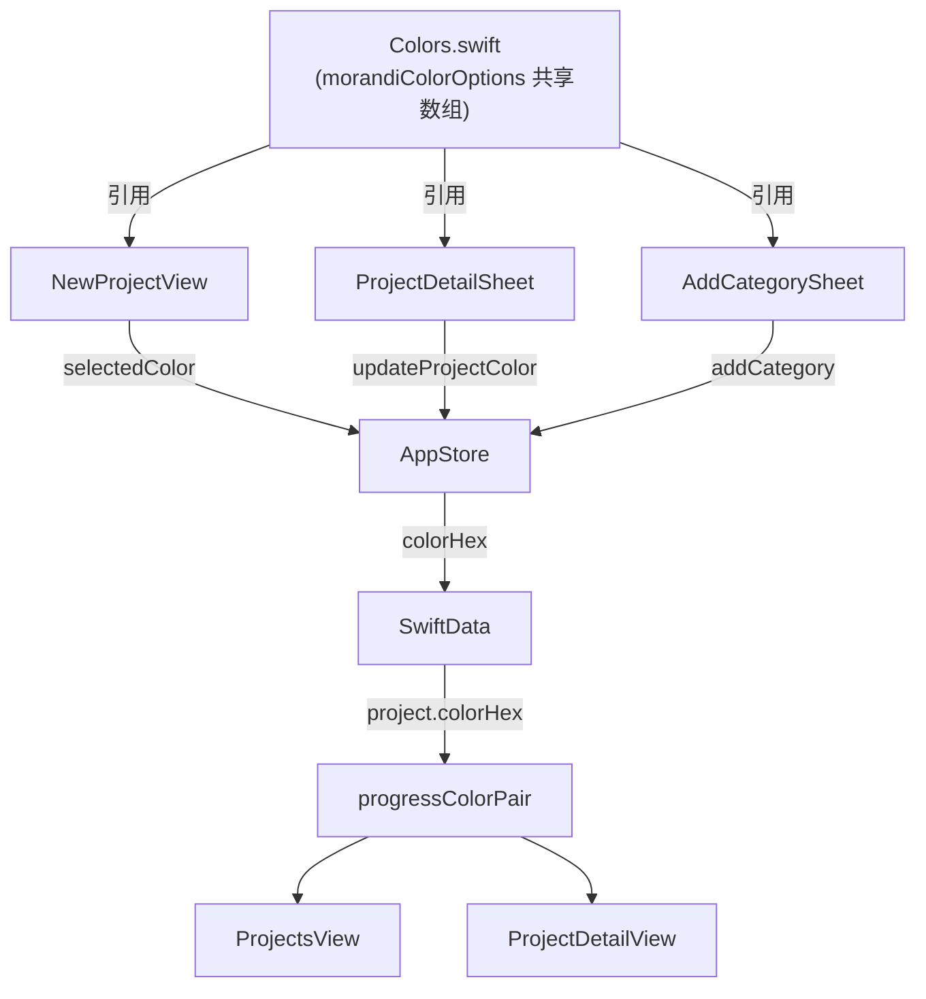

# 莫兰迪配色全局统一

## 问题现状

两套颜色系统完全割裂，互不一致：

- **项目颜色**（`NewProjectView`）：颜色与图标强绑定，无独立选色，`progressColorPair()` 只认7个旧色号
- **分类颜色**（`CategoryManagementView` + `AddRecordView`）：两处各自硬编码一份15色数组（内容还略有不同），都是 Material Design 风格的稀释色
- **系统预设分类**（`AppStore.seedDefaultCategories`）：用旧色号（`#A8E6CF`/`#DCDE8D`/`#FDD1B4` 等），与任何色盘都不完全匹配

## 数据流



## 莫兰迪8色色盘

| 主色 hex | 名称 | 深色 variant | 适合的分类 |
|---|---|---|---|
| `#A8E0C2` | 薄荷绿 | `#3A7A5E` | 住房 |
| `#B3D1E6` | 雾霾蓝 | `#2E6A8A` | 交通、通讯 |
| `#F6D7A8` | 杏色 | `#8A5A1E` | 餐饮 |
| `#F2B7C6` | 雾粉红 | `#8A3A52` | 购物、服饰 |
| `#D8C6E8` | 薰衣草紫 | `#5A3A7A` | 娱乐 |
| `#BFE6EA` | 浅青 | `#2A7A82` | 医疗 |
| `#C8E6C9` | 嫩绿 | `#2E6E30` | 教育 |
| `#DCCFC4` | 暖米色 | `#7A5A3E` | 日用、其他 |

## 改动文件

### 1. [`Utils/Colors.swift`](moneyfull_ios/Utils/Colors.swift)

在 `Color.App` 里新增：

```swift
// 莫兰迪8色具名常量
struct Morandi {
    static let mint        = Color(hex: "#A8E0C2")
    static let mistBlue    = Color(hex: "#B3D1E6")
    static let apricot     = Color(hex: "#F6D7A8")
    static let blushPink   = Color(hex: "#F2B7C6")
    static let lavender    = Color(hex: "#D8C6E8")
    static let aqua        = Color(hex: "#BFE6EA")
    static let sage        = Color(hex: "#C8E6C9")
    static let warmBeige   = Color(hex: "#DCCFC4")
}

// 全局共享色盘数组，项目/分类选色器共同引用
static let morandiColorOptions = [
    "#A8E0C2", "#B3D1E6", "#F6D7A8", "#F2B7C6",
    "#D8C6E8", "#BFE6EA", "#C8E6C9", "#DCCFC4",
]
```

### 2. [`Views/NewProjectView.swift`](moneyfull_ios/Views/NewProjectView.swift)

- 解耦颜色与图标：`iconOptions` 改为只存 `[String]`（不再带 color 元组），选图标只更新 `selectedIcon`
- `selectedColor` 默认值改为 `"#A8E0C2"`
- 图标选择区块下方新增"选择颜色"区块，引用 `Color.App.morandiColorOptions`，4列 2行排列，选中状态有描边

### 3. [`Views/ProjectsView.swift`](moneyfull_ios/Views/ProjectsView.swift)

`progressColorPair()` 补充8个莫兰迪 case：

```swift
case "A8E0C2": return ProgressColorPair(start: "#A8E0C2", end: "#3A7A5E")
case "B3D1E6": return ProgressColorPair(start: "#B3D1E6", end: "#2E6A8A")
case "F6D7A8": return ProgressColorPair(start: "#F6D7A8", end: "#8A5A1E")
case "F2B7C6": return ProgressColorPair(start: "#F2B7C6", end: "#8A3A52")
case "D8C6E8": return ProgressColorPair(start: "#D8C6E8", end: "#5A3A7A")
case "BFE6EA": return ProgressColorPair(start: "#BFE6EA", end: "#2A7A82")
case "C8E6C9": return ProgressColorPair(start: "#C8E6C9", end: "#2E6E30")
case "DCCFC4": return ProgressColorPair(start: "#DCCFC4", end: "#7A5A3E")
```

### 4. [`Models/AppStore.swift`](moneyfull_ios/Models/AppStore.swift)

**新增方法：**
```swift
func updateProjectColor(_ project: Project, colorHex: String) {
    project.colorHex = colorHex
    save()
    refresh()
}
```

**`seedDefaultCategories` 颜色对齐莫兰迪：**
```swift
("餐饮",  "fork.knife",              "#F6D7A8"),
("交通",  "car.fill",                "#B3D1E6"),
("购物",  "bag.fill",                "#F2B7C6"),
("娱乐",  "gamecontroller.fill",     "#D8C6E8"),
("住房",  "house.fill",              "#A8E0C2"),
("医疗",  "heart.text.square.fill",  "#BFE6EA"),
("教育",  "graduationcap.fill",      "#C8E6C9"),
("通讯",  "phone.fill",              "#B3D1E6"),
("服饰",  "tshirt.fill",             "#F2B7C6"),
("日用",  "basket.fill",             "#DCCFC4"),
("其他",  "ellipsis.circle.fill",    "#DCCFC4"),
```

> 注意：`seedDefaultCategories` 只在数据库第一次为空时执行，现有用户数据不受影响。

### 5. [`Views/ProjectDetailView.swift`](moneyfull_ios/Views/ProjectDetailView.swift)

- 顶部导航栏右侧新增 `paintpalette` 图标按钮
- 点击弹出轻量 Sheet，包含标题 + 莫兰迪8色色盘 + 确认按钮
- 选色后调用 `store.updateProjectColor(project, colorHex: newColor)`，页面主题色实时响应

### 6. [`Views/CategoryManagementView.swift`](moneyfull_ios/Views/CategoryManagementView.swift) + [`Views/AddRecordView.swift`](moneyfull_ios/Views/AddRecordView.swift)

两处本地 `colorOptions` 数组直接替换为引用共享常量：

```swift
// 删除原来的 private let colorOptions = [...]
// 改为：
private let colorOptions = Color.App.morandiColorOptions
```

`AddCategorySheet` 的 `selectedColor` 默认值同步改为 `"#A8E0C2"`。
