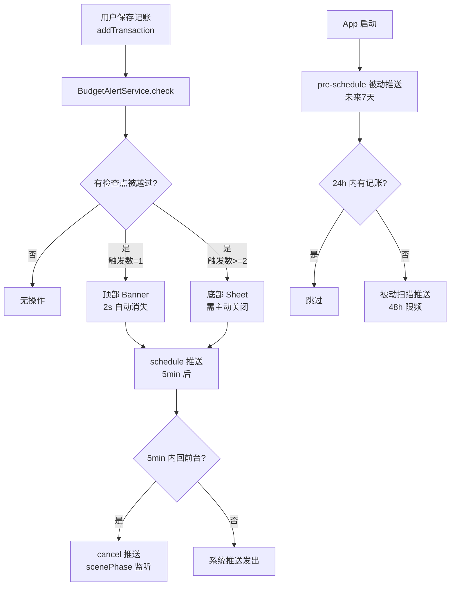

# 预算预警通知系统技术落地计划

## 现有架构关键节点

- 记账保存唯一入口：[AppStore.swift](moneyfull_ios/Models/AppStore.swift) `addTransaction()` → `save()` → `refresh()`，目前无任何预算检查钩子
- 数据字段已就绪：`Project.budgetAlertThreshold`、`BudgetItem.alertThreshold`（均存 SwiftData）
- 通知基础设施：[NotificationManager.swift](moneyfull_ios/Services/NotificationManager.swift) 仅有每日记账提醒，需扩展
- UI 设置入口：[BudgetManagementSheet.swift](moneyfull_ios/Views/BudgetManagementSheet.swift) 预算预警 Section 已有 Toggle+Slider 骨架，无 Step 控件
- 无 AppDelegate，生命周期靠 `scenePhase`（需新增）

## 整体数据流



## 需新增/修改的文件

### 新增文件（3个）

**1. `moneyfull_ios/Services/BudgetAlertService.swift`** — 核心引擎
- 单例 `BudgetAlertService.shared`
- `@Published var pendingAlerts: [BudgetAlertTrigger]` — 供 View 层观察
- `check(after tx: Transaction, in project: Project)` — 主入口，保存后调用
- 内部计算分类花费：`categorySpent(name:, in:)` 过滤 `project.transactions` 按分类名+周期
- 检查点计算：`crossedCheckpoints(current: Double, previous: Int, threshold: Double, step: Double) -> [Int]`
- UserDefaults 读写：key 格式 `budget_chk_project_{id}` / `budget_chk_category_{id}`，value 为已提醒最高检查点（Int，百分比整数）
- 重置函数：`resetCheckpoint(for projectID:)` / `resetCheckpoint(for categoryID:)`

**2. `moneyfull_ios/Components/BudgetAlertBanner.swift`** — 顶部 Toast（单触发）
- 从顶部滑入，2 秒后自动消失，可点击跳转预算详情
- 显示：分类图标 + 名称 + 当前百分比 + 卡皮 emoji（按进度分级）
- 动画：`withAnimation(.spring) { show = true }` + 2s `DispatchQueue.main.asyncAfter` 收起

**3. `moneyfull_ios/Components/BudgetAlertSheet.swift`** — 底部 Sheet（多触发）
- 展示所有触发对象的进度条列表（复用 `BudgetProgressRow` 样式）
- 卡皮完整文案（按最高进度分级）
- 按钮：「查看预算详情」跳转 / 「知道了」关闭

### 修改文件（5个）

**4. `moneyfull_ios/Models/Models.swift`**
- `Project` 新增字段：`var budgetAlertStep: Double = 0.05`（默认 5%，每个项目独立设置）

**5. `moneyfull_ios/Models/AppStore.swift`**
- `addTransaction` 在 `save()` 后追加：`BudgetAlertService.shared.check(after: tx, in: project)`
- `updateTransaction` 同样追加检查
- `updateProject` 参数补充 `budgetAlertStep`，并在阈值/预算金额变更时调用 `resetCheckpoint`

**6. `moneyfull_ios/Services/NotificationManager.swift`**
新增三个方法：
```swift
// 记账触发型：schedule 5min 后推送（防抖，相同 identifier 覆盖旧的）
func scheduleBudgetAlertPush(projectID: UUID, alerts: [BudgetAlertTrigger])

// 用户回前台时取消待发推送
func cancelPendingBudgetPush(projectID: UUID)

// 被动扫描型：App 启动时 pre-schedule 未来 7 天（每天固定时间检查）
func schedulePassiveBudgetChecks(projects: [Project])
```
- 新增 UserDefaults keys：`budget_push_enabled`（Bool）、`budget_passive_enabled`（Bool）、`budget_passive_last_{projectID}`（Date）

**7. `moneyfull_ios/Views/BudgetManagementSheet.swift`**
- 预算预警 Section 内，Pro 分支新增 Step 控件：`Slider(in: 0.01...0.20, step: 0.01)` + `Stepper` 组合，绑定 `project.budgetAlertStep`
- 新增两个 Toggle：「离开 App 后推送」和「多天未开 App 时提醒」
- 预警阈值 Slider 同步改为 Slider+Stepper 组合，step 从 0.05 改为 0.01
- 阈值或金额变更时调用 `BudgetAlertService.shared.resetCheckpoint`

**8. `moneyfull_ios/moneyfull_iosApp.swift`**
- 注入 `BudgetAlertService` 为 `@StateObject` 并传入环境
- 监听 `scenePhase`：从 `.background` 回到 `.active` 时调用 `NotificationManager.shared.cancelPendingBudgetPush`
- App 启动时调用 `schedulePassiveBudgetChecks`

**Banner/Sheet 挂载点：`MainTabView` 或 `ContentView`**
- 添加 `.overlay` 监听 `budgetAlertService.pendingAlerts`
- 按触发数量决定显示 Banner 还是 Sheet

## 卡皮情绪分级（BudgetAlertService 内枚举）

```
< 100%  → emoji "🍊"  文案：有点超了，还在可控范围
100~120% → emoji "🍊💦" 文案：超预算啦，深呼吸
120~150% → emoji "🦫💦" 文案：超了很多，要不要调整预算？
> 150%  → emoji "🫧"  文案：钱嘛，乃身外之物
```

## 开发顺序（按 PRD 优先级）

- P0：新增 `BudgetAlertService` + `BudgetAlertBanner` + `BudgetAlertSheet`，改 `AppStore.addTransaction`，改 `Models.swift` 加 `budgetAlertStep`
- P1：改 `NotificationManager` 加推送方法 + 改 `moneyfull_iosApp.swift` 加 scenePhase
- P2：`schedulePassiveBudgetChecks` 被动推送
- P3：`BudgetManagementSheet` Step 设置 UI
- P4：卡皮情绪分级文案完善
