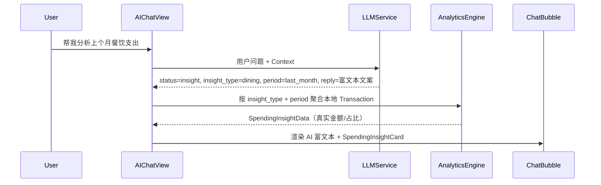

# AI 对话页视觉迭代文档 v2.2

> 基于用户提供的 AI 对话页 UI 设计稿（2026-05-26），在现有 `AIChatView` 基础上进行视觉与交互升级。  
> **✅ 已确认，进入开发阶段（2026-05-27）**

---

## 一、迭代背景与目标

### 1.1 背景

当前 AI 对话页已完成基础功能（语音/文字/OCR 记账、交易确认卡片、快捷指令唤起等），但视觉与竞品/设计稿仍有差距：

- Header 为简单毛玻璃条，缺少设计稿中的**渐变装饰背景**
- AI 消息左侧仍使用 Emoji 占位头像
- AI 回复为纯文本，无法高亮金额、百分比等关键数字
- 缺少**消费洞察卡片**（带进度条的分析类回复）
- 聊天区缺少**日期分割线**（如「今天 10:24 AM 🌸」）

### 1.2 本次目标

| 模块 | 目标 |
|------|------|
| 整体视觉 | 对齐设计稿：薄荷绿、大圆角、柔和阴影、点状背景 |
| Header | 渐变装饰 + 居中标题 + 右侧头像；背景延伸至状态栏 |
| 头像资产 | AI 消息左侧使用「小满头像.png」；Header 右侧头像**去掉**（纯标题居中布局） |
| 富文本气泡 | AI 回复支持 `**加粗**` 高亮金额/百分比 |
| 消费洞察卡片 | 新增 `SpendingInsightCard`，展示分类拆解与进度条 |
| 快捷芯片 | 保留并优化「本月预算 / 省钱建议 / 导出报告」**仅做 UI，暂不绑定功能逻辑** |
| 兼容性 | 不破坏现有记账流程（确认卡片、入账后修改/删除） |

### 1.3 不在本次范围

- 编辑账单页字段对齐（见 v2.1 文档）
- AI 对话历史完整结构化回放（卡片类消息的历史还原，v2.1 已规划）
- 用户自定义头像上传系统（Header 右侧使用固定设计资产）

---

## 二、设计稿对照（Current vs Target）

### 2.1 Header

| 元素 | 当前实现 | 目标设计 |
|------|----------|----------|
| 背景 | 白色半透明 + Material | ✅ **纯 SwiftUI 代码渐变**（薄荷绿 `#E8F8F2` → 白色），叠加星星/小叶子装饰，无需用户提供图片 |
| 左侧 | 圆形返回按钮 | 保持一致 |
| 标题 | ✨ 小满-您的财务管家 ✨ | 保持一致，深绿色加粗，**居中** |
| 右侧 | 🦫 Emoji 占位 | ✅ **去掉头像，Header 纯标题居中布局** |
| 顶部间隙 | 已用 `ignoresSafeArea(edges: .top)` | 背景必须铺满状态栏区域，内容仍在 Safe Area 内 |

### 2.2 聊天区

| 元素 | 当前实现 | 目标设计 |
|------|----------|----------|
| 背景 | 点状网格 `#FAFBFA` | 保持，可微调点密度 |
| 日期分割 | 无 | 新增 `ChatDateDivider`：「今天 HH:mm 🌸」 |
| 用户气泡 | 白底、右对齐、不对称圆角 | 保持现有风格，微调阴影 |
| AI 气泡 | 薄荷绿底、左对齐 | 左侧增加 **小满头像**（`小满头像.png`，已提供，圆形裁剪） |
| AI 文本 | `Text(message.content)` 纯文本 | **富文本渲染**：金额/百分比加粗深绿 |
| 洞察卡片 | 无 | 新增，附在 AI 文本气泡下方 |

### 2.3 底部输入区

| 元素 | 当前实现 | 目标设计 |
|------|----------|----------|
| 快捷芯片 | 4 个（含周期账单） | 对齐设计稿 3 个：本月预算、省钱建议、导出报告 |
| 输入框 | 相机 + 语音 + 文本 + 发送 | 改为 **「+」+ 文本 + 发送**（「+」内收纳：相册、语音） |
| 占位文案 | 问我任何财务问题鸭... | 问我任何财务问题吧... |
| 容器 | 圆角顶部 40pt | 保持大圆角 + 毛玻璃 |

---

## 三、资产说明（✅ 已确认）

| 资产名 | 用途 | 状态 |
|--------|------|------|
| `ai_chat_avatar` | AI 消息左侧小满头像 | ✅ 已提供：`小满头像.png`（绿底白熊圆形图标） |
| Header 右侧头像 | — | ✅ **去掉，不需要** |
| Header 背景 | — | ✅ **纯代码实现，不需要图片** |

---

## 四、功能设计

### 4.1 AI 气泡富文本高亮

#### 需求

设计稿中 AI 回复示例：

> 嗨！上个月您的餐饮支出共计 **¥1,280**，占总支出的 **15%**，相比上月下降了 **5%**……

其中金额、百分比需**加粗 + 深绿色**，其余文字为常规字重。

#### 方案

**约定格式：** LLM 在 `reply` 字段中使用 Markdown 风格的 `**文本**` 标记需要高亮的内容。

**渲染层：** 新增 `RichChatTextView`，解析规则：

1. 按 `**...**` 分割字符串
2. 普通段：`font(.system(size: 15))`，颜色 `#1A4D3E`
3. 高亮段：`font(.system(size: 15, weight: .bold))`，颜色 `#226552`
4. 金额可额外略放大（17pt），与设计稿一致

**Prompt 调整（`LLMService`）：**

在 `parseTransaction` / 新增 `chatWithAnalytics` 的 system prompt 中增加：

```
当 status 为 "chat" 或 "insight" 时，reply 字段可使用 **双星号** 包裹需要强调的数字、金额、百分比。
示例：上个月您的餐饮支出共计 **¥1,280**，占总支出的 **15%**。
```

**降级策略：** 若 reply 不含 `**`，仍按纯文本显示，不影响现有逻辑。

---

### 4.2 消费洞察卡片（SpendingInsightCard）

#### 需求

当用户询问分析类问题（如「帮我分析上个月餐饮支出」）时，AI 除文字回复外，展示结构化卡片：

- 标题：如「餐饮支出洞察 🍩」
- 若干子项：图标 + 名称 + 金额 + 占比 + 彩色进度条
- 底部按钮：「查看完整明细 >」→ 跳转统计页或分类明细

#### 核心原则：数字以 App 本地统计为准

**不能让 LLM 编造金额。** 流程采用「本地算数 + LLM 写文案」：



#### 数据结构

**LLM 返回扩展字段（`TransactionParseResult` 新增）：**

```json
{
  "status": "insight",
  "insight_type": "category_group",
  "target_group": "餐饮",
  "period": "last_month",
  "reply": "嗨！上个月您的餐饮支出共计 **¥1,280**……"
}
```

**App 本地聚合结果（`SpendingInsightData`）：**

```swift
struct SpendingInsightData {
    let title: String           // "餐饮支出洞察"
    let emoji: String           // "🍩"
    let totalAmount: Double
    let totalExpenseRatio: Double  // 占总支出比例
    let momChangePercent: Double?  // 环比变化，可选
    let items: [InsightBreakdownItem]
}

struct InsightBreakdownItem {
    let icon: String            // emoji 或 SF Symbol
    let name: String            // "外卖"
    let amount: Double
    let ratio: Double           // 0~1
    let barColorHex: String
}
```

#### 子项拆分规则（v2.2 首版）

| insight_type | 拆分维度 | 示例 |
|--------------|----------|------|
| `category_group` | 该一级分类下的二级分类 | 餐饮 → 外卖/堂食/零食 |
| `project` | 某项目下的分类 | 吃喝项目 → 各二级分类 |
| `monthly_overview` | 各一级分类占比 | 本月总支出结构 |

首版优先实现 **`category_group` + `period=last_month`**，覆盖设计稿场景。

#### 「查看完整明细」行为

- 点击后 `dismiss()` AI 页，`MainTabView.selectedTab = 3`（统计页）
- 可选：通过 `Notification` 传递 `targetGroup=餐饮`，统计页自动聚焦该分类（二期）

---

### 4.3 快捷芯片行为（✅ v2.2 仅做 UI）

| 芯片 | v2.2 行为 | 后续规划 |
|------|-----------|----------|
| 本月预算 🐻 | **仅 UI 展示**，点击暂不触发逻辑 | v2.3 接入 insight 分析 |
| 省钱建议 💡 | **仅 UI 展示**，点击暂不触发逻辑 | v2.3 接入 LLM chat |
| 导出报告 📊 | **仅 UI 展示**，点击暂不触发逻辑 | v2.3 跳转统计页 |

> 三个芯片只渲染样式（胶囊、图标、文字），不绑定 action。

---

### 4.4 与现有消息类型的共存

`ChatMessage` 需扩展：

```swift
struct ChatMessage {
    // 现有字段...
    var spendingInsight: SpendingInsightData?  // 新增
    var usesRichText: Bool = false             // 新增，标记 reply 需富文本解析
}
```

`handleParseResult` 新增分支：

```swift
else if result.status == "insight" {
    // 1. 本地 AnalyticsEngine 计算 SpendingInsightData
    // 2. append ChatMessage(content: reply, spendingInsight: data, usesRichText: true)
}
```

**消息渲染优先级（ChatBubble）：**

1. `transactionCard` → 交易确认卡片
2. `spendingInsight` → 洞察卡片（可伴随上方 AI 文本气泡）
3. `projectCreation` → 项目创建卡片
4. `image` → 图片
5. 默认 → 富文本或纯文本气泡

---

## 五、技术实现方案

### 5.1 新增/修改文件

| 文件 | 改动 |
|------|------|
| `Views/AIChatView.swift` | Header 渐变、日期分割、富文本气泡、洞察卡片挂载、快捷芯片行为 |
| `Components/SpendingInsightCard.swift` | **新建** 消费洞察卡片 UI |
| `Components/RichChatTextView.swift` | **新建** `**` 解析与高亮渲染 |
| `Components/ChatDateDivider.swift` | **新建** 日期分割线 |
| `Services/LLMService.swift` | 扩展 `TransactionParseResult`；Prompt 增加 `insight` 与富文本规则 |
| `Services/AnalyticsEngine.swift` | **新建** 从 `Transaction` 聚合洞察数据（可从 `AnalyticsView` 抽离逻辑） |
| `Models/ChatMessage`（或在 AIChatView 内） | 增加 `spendingInsight`、`usesRichText` |
| `Assets.xcassets` | 接入用户提供的头像与可选 Header 背景 |

### 5.2 AnalyticsEngine 职责

从 `AppStore.recentTransactions` 读取数据，提供：

```swift
func insightForCategoryGroup(
    groupName: String,
    period: InsightPeriod,
    store: AppStore
) -> SpendingInsightData

enum InsightPeriod {
    case thisMonth
    case lastMonth
    case custom(Date, Date)
}
```

计算逻辑复用 `AnalyticsView` 中按月份筛选、`groupName` / `categoryName` 聚合的思路，避免重复造轮子。

### 5.3 LLM Prompt 扩展要点

1. 新增 `status: "insight"` 及字段 `insight_type`、`target_group`、`period`
2. `reply` 必须基于 Context 中**已有分类名**，但具体金额由 App 本地计算，Prompt 中明确写：
   > 「你不需要在 JSON 中返回具体分项金额，分项数据由 App 本地统计；你只需返回分析意图与友好文案。」
3. 闲聊 `chat` 状态同样允许 `**` 富文本

---

## 六、开发阶段划分

### Phase A：视觉骨架（1–2 天）

- [ ] 接入用户头像资产（AI 左侧 + Header 右侧）
- [ ] Header 渐变背景 + Safe Area 置顶
- [ ] `ChatDateDivider` 日期分割
- [ ] 底部输入区改为「+」收纳菜单
- [ ] 快捷芯片调整为 3 个

### Phase B：富文本气泡（0.5–1 天）

- [ ] `RichChatTextView` 组件
- [ ] LLM Prompt 增加 `**` 约定
- [ ] `ChatBubble` 接入富文本分支

### Phase C：消费洞察卡片（2–3 天）

- [ ] `AnalyticsEngine` 本地聚合
- [ ] `SpendingInsightCard` UI（进度条、标题、明细按钮）
- [ ] LLM `insight` 状态 + `handleParseResult` 分支
- [ ] 「查看完整明细」跳转统计页

### Phase D：联调与验收（1 天）

- [ ] 快捷芯片触发 insight / chat
- [ ] 与记账卡片、入账后修改/删除按钮共存测试
- [ ] 深色模式兼容性（可选，首版可仅保证浅色）

---

## 七、验收标准

### 7.1 视觉

- [ ] Header 背景延伸至状态栏，无顶部断层空白
- [ ] AI 消息左侧显示用户提供的机器人头像
- [ ] Header 右侧显示用户提供的头像
- [ ] 用户/AI 气泡圆角、颜色与设计稿一致（允许 ±5% 色值偏差）
- [ ] 日期分割线样式正确

### 7.2 富文本

- [ ] AI 回复中 `**¥1,280**` 渲染为加粗深绿色
- [ ] 无 `**` 的旧消息仍正常显示
- [ ] 不影响交易确认卡片内的文字

### 7.3 消费洞察

- [ ] 问「分析上个月餐饮支出」→ 出现 AI 文案 + 洞察卡片
- [ ] 卡片内金额为**本地真实数据**，与统计页可交叉验证
- [ ] 进度条占比之和约等于 100%（允许四舍五入误差）
- [ ] 点击「查看完整明细」可进入统计页

### 7.4 回归

- [ ] OCR / 语音 / 文字记账流程正常
- [ ] 交易确认 → 入账 → 修改/删除 正常
- [ ] 快捷指令唤起 AI 页正常

---

## 八、决策记录（✅ 已全部确认）

| # | 问题 | 最终决策 |
|---|------|----------|
| 1 | 快捷芯片功能 | ✅ v2.2 仅做 UI，不绑定逻辑 |
| 2 | Header 背景 | ✅ 纯 SwiftUI 代码渐变，无需图片资产 |
| 3 | 洞察卡片历史持久化 | ✅ **折中方案**：将 `SpendingInsightData` 序列化为 JSON 存入 `ChatHistory.content`，重新进入页面可完整还原卡片 |
| 4 | AI 消息头像 | ✅ 使用「小满头像.png」（已提供）|
| 5 | Header 右侧头像 | ✅ 去掉，Header 纯标题居中 |

---

## 九、与 v2.1 文档的关系

| 文档 | 范围 |
|------|------|
| **v2.1** 产品优化迭代 | 编辑页对齐、入账后修改/删除、对话历史加载 |
| **v2.2** 本文档 | AI 对话页视觉升级、富文本、消费洞察卡片 |

建议执行顺序：

1. v2.2 Phase A（视觉 + 头像）— 用户可提供资产后立即开始  
2. v2.2 Phase B + C（富文本 + 洞察卡片）  
3. v2.1 剩余项（编辑页、历史持久化增强）

---

## 十、确认清单（✅ 全部已确认，开始开发）

- [x] 设计稿视觉方向认可（Header 渐变、气泡、洞察卡片、输入区）
- [x] AI 消息头像：小满头像.png；Header 右侧头像去掉
- [x] Header 背景：纯代码渐变，无需图片
- [x] 富文本采用 `**` Markdown 方案
- [x] 洞察卡片数字以本地统计为准、LLM 只写文案
- [x] 洞察卡片历史持久化：折中方案（JSON 序列化还原）
- [x] 快捷芯片 v2.2 仅 UI，不绑定逻辑
- [x] 开发阶段：Phase A → B → C

---

*文档版本：v2.2 | 创建日期：2026-05-26 | 确认日期：2026-05-27 | 状态：开发中*
